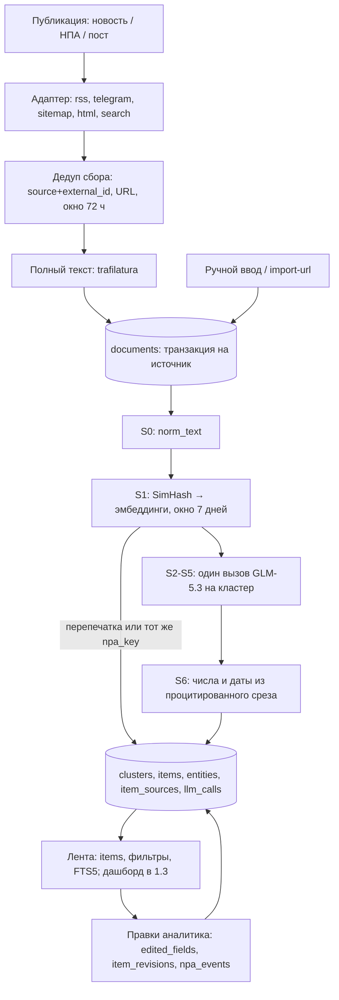

# Целевая архитектура

## Что должно быть:

- Основные компоненты; 
- Поток данных от входящего тикета до ответа/маршрутизации; 
- Синхронные и асинхронные части; 
- Хранилища; 
- Места вызова сервисов и интеграций; 
- Участие человека и запасные пути. 
- Использовать Mermaid для вспомогательных диаграмм.

*Статус на 04.09.2026: реализованы этап 1.1 «Сбор данных» (`src/sources`, `src/storage`, `src/cli.py`: пять адаптеров — rss, telegram, sitemap, html, search; пул источников пересобран 03.09.2026 под профиль GS Labs) и этап 1.2 «Интеллектуальная обработка» (`src/processing`, миграция БД до `PRAGMA user_version = 2`): документы схлопываются в кластеры и превращаются в карточки ленты. Всё, что ниже помечено «планируется», — целевой дизайн этапов 1.3–1.4 (дашборд, управление источниками и данными из UI); сегодня их закрывает CLI. Осознанные ограничения 1.2 названы там, где они влияют на схему: вложения (PDF и другие файлы) не читаются вовсе, длинные документы уходят в модель обрезанным префиксом, золотой набор для метрик качества ещё не размечен.*

## Основные компоненты

- **Резолвер источника + адаптеры** (`src/sources/resolver.py`, `scraper_*.py`). Пользователь вводит один URL, резолвер сам выбирает способ опроса: `tavily://search?q=…` → search (сохранённый запрос Tavily); любая другая не-http схема (например, `manual://import`) → manual — оба без единого HTTP-запроса; `t.me/…` → telegram; URL, похожий на ленту и разбирающийся feedparser'ом → rss; `<link rel="alternate">` или типовые пути (`/rss`, `/feed`, …) → rss; `robots.txt` / `sitemap.xml` с `lastmod` → sitemap; иначе → html (diff ссылок). Пять адаптеров за одним интерфейсом `Adapter.fetch(source, state, client, *, now, since, backfill) -> FetchResult` возвращают единый `RawDocument` (у `manual` адаптера нет — его наполняют руками); это и есть механика «добавления источника по ссылке» из требования 1.4.
- **Поисковый источник Tavily** (`scraper_search.py`, HTTP-обёртка `scraper_llm.py`). Источник kind `search` хранит не адрес, а запрос: `fetch_url = tavily://search?q=…&domains=…&days=N&topic=news|general&summary=1` (канонический, поэтому одинаковый запрос → тот же источник). Каждое попадание становится обычным документом (текст страницы из ответа Tavily после `clean_page_text`; если его меньше 400 символов — фрагменты Tavily плюс попытка trafilatura), а ответ Tavily — документом-дайджестом «Сводка: <запрос>» (`external_id` `summary:YYYY-MM-DD`, без URL, один на запрос в день). Дополнение к лентам, не замена: западные поисковые API плохо индексируют gov.ru, поэтому качество держится на `domains`.
- **Коллектор и извлечение полного текста** (`collector.py`, `fulltext.py`). Опрашивает включённые источники, отсекает дубли, дотягивает текст анонсов через trafilatura (заголовок / автор / дата / текст) и пишет в SQLite; `HostLimiter` держит не больше 2 одновременных запросов к одному хосту (`per_host_concurrency`, gov.ru банит бурсты). Для kind `search` окно 72 ч не применяется — запрос ограничен собственным `days`. `collect_one(source, force=True)` опрашивает один источник на вызывающем потоке — на нём построена команда `search`.
- **Сервис обработки** (`src/processing/service.py`). `ProcessingService` — единственная точка входа этапа 1.2 и того REST, который сядет на неё в 1.3: `run()` (документы без карточки → карточки), `reprocess()`, `edit_item()`, `add_npa_event()`, `quality_summary()`. Бизнес-логики выше этого файла нет — CLI только печатает результат.
- **Пайплайн S0–S6** (`normalize.py`, `dedup.py`, `pipeline.py`, `grounding.py`, `profile.py`). S0 — чистка HTML и boilerplate, результат в `documents.norm_text`; S1 — SimHash 64 бита по словесным 3-граммам плюс косинус по эмбеддингам среди кандидатов окна 7 дней; S2–S5 — один structured-output вызов на кластер: тип (`НПА` | `Новость`), саммари 3–5 предложений, сущности «кто / что / когда / последствия», приоритет (высокий / средний / низкий) с `relevance_score` и `reasoning`, теги (регуляторика / репутация / конкуренты / тренды / господдержка-льготы); S6 — проверка саммари на опору в оригинале правилами, без второй модели. Профиль компании (ООО «Цифра» / GS Labs) подставляется в промпт как версионируемый фрагмент — именно он решает, что для компании `high`.
- **Провайдер модели** (`src/processing/llm.py`). Протоколы `LLMProvider` / `EmbeddingProvider` и реализация `OllamaProvider` — единственный модуль репозитория с `import ollama`. Ошибки разделены: `LlmConfigError` (401/403/404 — неверный ключ или тег модели) останавливает прогон, `LlmTemporaryError` (429/5xx/сеть) уходит в повторы и затем в деградацию.
- **Хранилище и CLI** (`src/storage/db.py`, `src/cli.py`). SQLite `data/hub.db` — единственное место состояния (источники, документы, курсоры, история прогонов, карточки и телеметрия модели). CLI сегодня и интерфейс оператора, и «планировщик»: сбор — `collect [--watch --interval]`, `sources add|list|enable|disable|remove|resolve|seed`, `resolve`, `search`, `discover`, `import-url`, `docs`; обработка — `process [--limit --source --since --profile --force --dry-run]`, `items`, `item`, `edit`, `reprocess`, `npa-event`, `profile`, `quality`.
- **Планируется (1.3–1.4):** веб-дашборд с лентой, фильтрами, поиском и правками, REST поверх тех же методов `ProcessingService` (контракт зафиксирован в `specs/001-processing-news/contracts/rest-1.3.md`), управление источниками и ручное добавление материала из UI.

```mermaid
flowchart LR
    U[Оператор / аналитик] --> CLI[CLI: sources, collect, search, process, items, edit]
    U -. 1.3-1.4 .-> UI[Дашборд: лента, фильтры, поиск, правки]
    CLI --> R[Резолвер URL / tavily://]
    CLI --> C[Коллектор + fulltext: trafilatura, HostLimiter]
    CLI --> P[ProcessingService: run, edit, reprocess, quality]
    C --> A[Адаптеры: rss, telegram, sitemap, html, search]
    A --> EXT[Внешние сайты: СМИ, регуляторы, Telegram]
    A --> TAV[Tavily API]
    R --> DB[(SQLite data/hub.db)]
    C --> DB
    P --> PIPE[Пайплайн S0-S6: normalize, dedup, LLM, grounding]
    PIPE --> OLL[Ollama Cloud: GLM-5.3 + эмбеддинги]
    P --> DB
    UI -. 1.3-1.4 .-> DB
```

## Поток данных: от входящей публикации до ленты

*В шаблоне это «поток от входящего тикета до ответа/маршрутизации». Тикетов в продукте нет: единица потока — публикация (новость / НПА / пост Telegram-канала), а «ответ и маршрутизация» — карточка в ленте с категорией и приоритетом.*

- **Сбор (реализовано).** Каждый тик (`collect --watch --interval 900`, то есть 15 минут — ориентир task.md «материал в ленте за 15 минут, сайты регуляторов — до часа») коллектор опрашивает каждый включённый источник его адаптером: RSS — условный GET по ETag / Last-Modified (на втором smoke-прогоне все RSS-ленты с ETag ответили 304), Telegram — только посты после курсора `last_post_id` (веб-превью — до 5 страниц `?after=` за тик, MTProto — до `max_posts`), sitemap — записи новее курсора `lastmod` (до 5 дочерних sitemap, 200 URL), HTML — ссылки, которых ещё нет в `seen_urls`, search — один POST к Tavily: первый запуск / `--force` / `--backfill` спрашивают последние `days`, дальше `start_date` = день предыдущего прогона − 1 (курсор `since`; перекрытие на сутки, потому что даты Tavily — UTC-дни), ровно одна граница свежести на запрос; `include_raw_content=text`, `include_answer=advanced` при `summary=1`, `country` (только `topic=general`) и `language` из `config.yaml` (`language: ru` — иначе сводка приходит по-английски, но и с ним Tavily соблюдает язык не всегда: «Сводка» может вернуться по-английски).
- **Дедуп, полный текст, сохранение (реализовано).** Отбрасывается всё, что уже есть по `(source_id, external_id)` или по URL (правило по URL не трогает документы без пути — «Сводку» search и ленты, где все записи ведут на одну посадочную); на первом запуске берутся материалы не старше 72 ч (`date_window_hours`) — кроме kind `search`, где окно задаёт сам запрос (`days`); недатированные остаются (страницы НПА часто без даты), не больше 50 новых на источник за проход (`max_new_per_source`). Для анонсов полный текст дотягивается trafilatura (до 20 000 символов). Запись — одна транзакция на источник: документы + ETag/курсор + `fetch_state` вместе, чтобы курсор не ушёл вперёд без документов. Smoke-прогон 02.09.2026 по прежнему пулу: 17/17 источников, 268 документов за первый проход, все три категории источников (СМИ, регуляторы, Telegram); второй проход — 0 новых. Прогон 03.09.2026 по новому пулу (scratch-БД, dev-машина за рубежом): `sources seed` — 41 источник, 32 включены; первый `collect` — 538 новых документов, 31 из 32 включённых источников OK (Кабельщик, sitemap — таймаут), все три категории (СМИ, регуляторы, Telegram) плюс Telegram-зеркала, ≈ 7 мин 20 с; второй `collect` — Ведомости 304 Not Modified, ТАСС и Коммерсантъ по +50 (`max_new_per_source` добирает 72-часовое окно), остальное 0 новых; после двух проходов 759 документов = 759 уникальных URL = 759 уникальных пар `(source_id, external_id)`. `search`: новостной запрос по `@media` — 6 попаданий + «Сводка», `--general` по gov.ru-доменам — 19 попаданий (`start_date`, `country`); `scripts/happy_path_pr.sh` (4 попадания, одно уже известно через RSS Телеспутника, «Сводка») и `scripts/happy_path_gr.sh` (18 попаданий СОЗД / Минцифры + «Сводка» по-русски) отработали с кодом 0, повторный запуск PR идемпотентен (только новая «Сводка»).
- **Нормализация и схлопывание дублей (реализовано, S0–S1).** `process` берёт документы, у которых нет строки в `item_sources` (то есть нет карточки), чистит текст в `norm_text` и ищет, к чему документ примыкает: сначала SimHash (расстояние Хэмминга ≤ 3), затем косинус по эмбеддингам (порог 0.86) — только среди уже окарточенных документов окна 7 дней. Перепечатка не тратит вызов модели: она добавляется в `item_sources` существующей карточки и увеличивает `clusters.size`. Для НПА склейка по похожести запрещена — документ прикрепляется к долгоживущей карточке только по совпадению `items.npa_key` (номер СОЗД, id проекта на regulation.gov.ru, номер акта).
- **Саммаризация, категоризация, приоритизация (реализовано, S2–S6).** Один structured-output вызов на кластер (схема уходит параметром `format`, поэтому синтаксически битого JSON не бывает) даёт тип, саммари в 3–5 предложений, сущности, приоритет с обоснованием и теги; S6 правилами снимает предложения без опоры в оригинале. Ориентир task.md — 10–15 с на публикацию; факт по каждому вызову пишется в `llm_calls` (модель, токены, латентность, статус). Длинные документы уходят обрезанным префиксом, а не map-reduce: `evidence_offsets` — координаты в `norm_text`, пересказ их ломает, поэтому такие карточки помечаются и получают `confidence × 0.7`.
- **Запись карточки (реализовано).** Одна транзакция на кластер: `clusters` → `items` → `entities` → `item_sources` → `llm_calls`, для НПА плюс первое событие в `npa_events`. Повторный `process` без новых документов создаёт 0 карточек и 0 вызовов модели; `--force` перечитывает документы, но окарточенные идут через `reprocess`, а не плодят дубли.
- **Лента и правки (лента — CLI, дашборд планируется в 1.3–1.4).** `items` читает карточки с фильтрами по типу, приоритету, тегу, дате и полнотекстовым поиском через `items_fts` (ориентир < 1 с, все поля сохранены — модель в рантайме не зовётся), `item` показывает карточку целиком с источниками, хронологией НПА и историей правок. Правки аналитика (`edit`, `npa-event`) уже работают: изменённое поле попадает в `items.edited_fields`, «было/стало» — в `item_revisions`. Планируется: те же операции из дашборда, скрытие публикации и источника, форма ручного добавления материала.



## Синхронные и асинхронные части

- **Сбор: пул потоков + запись в главном потоке.** Опрос источников идёт в `ThreadPoolExecutor` (`concurrency: 8`), рабочие делают только HTTP и разбор; вся запись в SQLite — в главном потоке по мере готовности результатов (`as_completed`). Полный текст дотягивается на этапе сохранения отдельным пулом (до 8 потоков на источник) под лимитом 2 запроса на хост. Расписание — цикл `collect --watch` с паузой `--interval` (900 с по умолчанию); настоящего планировщика нет.
- **Telegram MTProto: asyncio внутри пула потоков (реализовано).** Telethon асинхронный, а коллектор — пул потоков, поэтому на прогон поднимается один фоновый event loop с одним подключённым клиентом, и рабочие потоки отдают ему работу через `run_coroutine_threadsafe`: параллельные запросы истории ограничены `telegram.concurrency` (2 — аккаунт лучше не разгонять), история одного канала — `telegram.request_timeout` (60 с), а `flood_sleep_threshold` (60 с) ограничивает ожидание FloodWait — более долгое становится ошибкой этого источника, а не паузой всего прогона. Клиент отключается в конце прогона (`Collector.close` из `finally` в `run`); чтение пассивное — каналы не подписываются, `iter_messages` не двигает указатель прочитанного.
- **Синхронно для пользователя:** `sources add` (резолвер: основной запрос с таймаутом 30 с, пробы типовых путей — 8 с, чтобы медленный сайт не подвешивал команду; `tavily://` и другие не-http схемы закрываются без HTTP), `search` (`collect_one` на вызывающем потоке: один запрос к Tavily с таймаутом 30 с плюс дотяжка тонких страниц; результат печатается сразу — `+` новое / `=` уже было — и «Сводка»), `import-url` (страница → trafilatura → БД), а также чтение и правка карточек: `items`, `item`, `edit`, `npa-event`, `quality` работают только с БД, без обращения к модели (ориентир < 1 с).
- **Обработка: та же схема разделения (реализовано).** S0 и S1 считаются на главном потоке (нормализация, SimHash, один батчевый запрос эмбеддингов на прогон), медленные вызовы модели идут в `ThreadPoolExecutor` с `processing.concurrency = 2` — как `per_host_concurrency` у коллектора: низкий параллелизм бережёт квоту облака. Все записи — на главном потоке, одна транзакция на кластер, поэтому SQLite остаётся однопоточным писателем. Внутри одного вызова модели ретраи синхронные: до двух повторов с экспоненциальной паузой (`llm.max_retries: 2`, `retry_backoff: 2 с`), таймаут запроса 90 с при бюджете 15 с на публикацию — запас на хвост, а не норма.
- **Быстрый и медленный путь разведены по командам.** Быстрый — `collect`: документ в базе через секунды после тика, виден в `docs` и в отставании обработки. Медленный — `process`: кластеризация и модель. Сбор от модели не зависит вообще; при недоступной модели `process` всё равно создаёт карточки, только деградированные. Обратное тоже верно: `items`, `item` и поиск читают только сохранённые поля и модель не зовут.
- **Планируется: планировщик** вместо `--watch`: раздельные интервалы по типу источника (Telegram и RSS чаще, sitemap/HTML реже, search — реже всех, потому что каждый опрос стоит кредиты Tavily; допущение, сегодня один интервал на всех) и автозапуск `process` по факту появления новых документов — сейчас его запускает человек или cron.

## Хранилища

- **SQLite `data/hub.db`** — WAL, `foreign_keys`, `busy_timeout` 5 с, миграции по `PRAGMA user_version` (сейчас v2 — её добавил этап 1.2). WAL выбран, чтобы дашборд мог читать, пока `collect --watch` пишет. Одно соединение на процесс, только из главного потока. PostgreSQL и pgvector отложены осознанно (`specs/001-processing-news/research.md`, R-01 и раздел «БД» спецификации): на текущем объёме FTS5 заменяет GIN, а вектора перебираются в Python за миллисекунды.
- **Таблицы:** `sources` (что ввёл пользователь + `kind` / `fetch_url`, выбранные резолвером, `enabled`; `fetch_url` UNIQUE — поэтому повторный `search` с тем же запросом находит существующий источник, а не плодит новые); `documents` (нормализованный `RawDocument`: заголовок, анонс, текст, автор, вложения, `published_at`, `content_hash`; `UNIQUE(source_id, external_id)`, индекс по URL; `hidden` зарезервировано под 1.4; у «Сводки» search URL пустой); `fetch_state` (ETag, Last-Modified, JSON-курсор адаптера — `last_post_id` и `transport` у telegram, `lastmod` у sitemap, `since` / `days` у search, — `last_error`, `consecutive_failures`); `seen_urls` (что html-адаптер уже видел); `collect_runs` (история прогонов, включая разовые `search`). `raw_html` по умолчанию не хранится (`store_raw_html: false`).
- **Таблицы обработки (миграция v2):** `clusters` (группа перепечаток, центроид, `size`, зарезервированный `has_divergent_opinions`), `items` (карточка: тип, `npa_status` / `npa_key`, саммари, приоритет, `relevance_score`, `reasoning`, `confidence`, теги, `analyst_note`, флаги `degraded` / `needs_review` / `date_estimated`, `model_name` / `prompt_version` / `profile_version`, `edited_fields`), `entities`, `item_sources` (карточка ↔ перепечатки, `is_canonical`), `npa_events` (хронология статусов, `created_by = system | user`), `item_revisions` (аудит правок: поле, было/стало, кто, когда), `company_profiles`, `prompt_versions`, `llm_calls` (телеметрия вызовов). Плюс три колонки в `documents`: `simhash`, `embedding` (`float32` BLOB), `norm_text` — последняя хранится потому, что `evidence_offsets` считаются именно по ней.
- **Поиск — FTS5 в той же базе:** виртуальная таблица `items_fts` по `title` и `summary` с триггерами на insert/update/delete, так что индекс не расходится с лентой; теги ищутся через `json_each(items.tags)` — выносить их в отдельную таблицу до замера незачем.
- **Сессия Telegram — второй файл SQLite (реализовано).** `data/<session_name>.session` (по умолчанию `telegram.session`) хранит ключ MTProto-сессии: это равно доступу к аккаунту, поэтому файл в `.gitignore` и не коммитится, а `api_id` / `api_hash` живут в `.env` (`TELEGRAM_API_ID`, `TELEGRAM_API_HASH`, выдаются на my.telegram.org), а не в `hub.db`. Заодно сессия кэширует резолвинг каналов, так что имя канала стоит одного запроса только на первом прогоне.
- **Планируется (1.3–1.4):** скрытие публикации и источника из UI (`documents.hidden` и `items.is_hidden` уже есть), архивация новостей и принятых НПА по расписанию (`items.is_archived` зарезервировано), заполнение `has_divergent_opinions` — сейчас колонка есть, но признак «разные позиции по одному событию» ещё не вычисляется.
- **Внешние хранилища не нужны:** вложения хранятся ссылками (`attachments`), кэш страниц — сама таблица `documents`. PostgreSQL (стек заказчика GS Labs) — на выбор при выходе за прототип, критерий — несколько писателей/сервисов; для одного процесса SQLite достаточно (промышленная нагрузка вне скоупа хакатона).

## Места вызова сервисов и интеграций

- **Внешние сайты (реализовано):** пул `sources.json` собран только из `context/sources_for_company.md` (профиль GS Labs): 41 источник — 14 СМИ (RSS: CNews, TAdviser, Коммерсантъ, ТАСС, Lenta.ru, Телеспутник, Habr, Ведомости; sitemap: Кабельщик), 9 регуляторов (три ленты API `publication.pravo.gov.ru/api/rss?block=government|federal_authorities|president`, government.ru, Роскомнадзор, ФНС — RSS; РФРИТ — sitemap; ФСБ — HTML-diff), 16 зеркал `t.me/s/<канал>`, 2 поисковых запроса; 32 включены. Низкоприоритетные и не подтверждённые из-за рубежа (РБК, D-Russia, КонсультантПлюс, RusCable, Forbes, ЦБ, Торгпред) засеяны с `"enabled": false`. Всё без ключей и учёток, кроме Tavily и Telegram-аккаунта для MTProto. Один общий `httpx.Client` на прогон, браузерный User-Agent, `Accept-Language: ru`, таймаут 30 с (`request_timeout`; поднят с 20, потому что Коммерсантъ, CNews и ТАСС из-за рубежа отвечают ~17 с), до 5 редиректов; ошибки не выбрасываются, а возвращаются в `FetchResult.error`. Операционное ограничение: gov.ru и часть СМИ ограничивают доступ с зарубежных IP — dev-стенд за рубежом видит таймауты, выключенные источники перепроверяются из РФ (`sources resolve`, `sources enable`).
- **Telegram: два транспорта, один kind (реализовано).** Источники `telegram` читаются через MTProto (Telethon, личный аккаунт оператора), если есть файл сессии, и через веб-превью `t.me/s/<канал>` в остальных случаях; выбор задаёт `telegram.mtproto: auto | off | only` в `config.yaml`, а нумерация постов у транспортов общая, поэтому `cursor.last_post_id` и сохранённые `external_id` переживают смену транспорта без повторного импорта и дублей (курсор помнит и сам транспорт — `cursor.transport`). MTProto добавляет каналы с выключенным превью, догоняние дальше пяти страниц `?after=` (`telegram.max_posts` за проход, `backfill_posts` при `--backfill`) и имена вложенных файлов — так видны ПДФ-дайджесты АРПП и РФРИТ; сами файлы не скачиваются, в `attachments` идут внешние ссылки плюс записи `file:<имя>`.
- **Tavily (реализовано, две роли)** — ключ `TAVILY_API` из `.env`, первая из двух платных интеграций. (1) `discover` — поиск кандидатов в источники, найденные сайты прогоняются через резолвер (`--add`); документов не создаёт. (2) Источники kind `search` — сохранённый запрос опрашивается `collect` наравне с лентами (`SearchAdapter` в `build_adapters`): до 20 результатов за запрос (потолок API), `days` / `country` / `language` по умолчанию из `config.yaml` (`tavily.days: 7`, `tavily.country: russia`, `tavily.language: ru`). Каждый опрос стоит кредиты (`include_answer=advanced` и `search_depth=advanced` — дороже базового), поэтому два засеянных запроса — «упоминания GS Labs / Триколор» (news, 7 дн., домены отраслевых СМИ) и «проекты НПА — ПО, ПД, КИИ» (general, 14 дн., regulation.gov.ru, СОЗД, pravo.gov.ru, government.ru, digital.gov.ru) — выключены по умолчанию. Отсутствие ключа — ошибка в `fetch_state` конкретного источника, а не падение прогона. Дополнение к лентам, не замена: западные поисковые API плохо индексируют gov.ru. Планируется: Yandex Search API для доменов регуляторов и обогащение карточки («кто ещё писал о законопроекте»).
- **Ollama Cloud (реализовано, вторая платная интеграция)** — `https://ollama.com`, модель `glm-5.3:cloud`, ключ `OLLAMA_API_KEY` из `.env` (в логи и в БД не попадает); тем же клиентом и ключом считаются эмбеддинги (`embed_model: embeddinggemma`, 768). Зовётся только из `process` и `reprocess` — никогда из чтения ленты. Вход — профиль компании плюс поля документа: заголовок, источник, дата и `norm_text`, обрезанный до `processing.max_chars = 12000`; для НПА этого хватает, потому что по Q&A нужна пояснительная записка, а не тело акта. Выход — ответ по JSON Schema (`format`), который дальше проверяется своим кодом. `analyst_note` в промпт не передаётся конструктивно: функция сборки промпта его просто не принимает. Смена провайдера (GigaChat, YandexGPT, self-hosted) — это новая реализация `LLMProvider` и другой `model` в конфиге, пайплайн не меняется; выбор модели и метрики — в `ml.md`.
- **Отдельные адаптеры (планируется):** regulation.gov.ru (Next.js-приложение: RSS-подписка и Open Data API требуют своего адаптера) и СОЗД Госдумы (публичного API нет; карточка законопроекта со стадиями и версиями) — до тех пор оба закрыты поисковым источником «проекты НПА» по домену; reestr.digital.gov.ru (только поиск с URL-параметрами — мониторинг включений своих и конкурентных продуктов в реестр ПО). Без адаптера, но с оговоркой на сеть: digital.gov.ru и ФСТЭК (таймаут из-за рубежа / сертификат российского УЦ на bdu.fstec.ru), сайты ComNews и RSpectr (не отвечают из-за рубежа; их Telegram-зеркала включены), Broadcasting.ru (TLS обрывается из-за рубежа). Все 8 — в `excluded` в `sources.json` с причиной. publication.pravo.gov.ru закрыт штатным RSS-адаптером через `/api/rss?block=…` (API отвечает только по http).

## Участие человека и запасные пути

- **Резолвер деградирует ступенями:** ленты нет → sitemap с `lastmod` → diff ссылок HTML; недоступный сейчас сайт всё равно добавляется как html с пометкой «unreachable now»; приватная Telegram-ссылка и любая не-http схема — как `manual` без HTTP (сломанный `tavily://` — тоже manual с пометкой). `sources add --kind --fetch-url` закрепляет адрес руками — так закреплён весь `sources.json` (адреса лент проверены вручную 03.09.2026, `sources seed` не ходит в сеть), `sources resolve` перепроверяет и сбрасывает курсор.
- **Сбой одного источника не останавливает прогон:** ошибка пишется в `fetch_state.last_error` / `consecutive_failures` и видна в `sources list` — в том числе «no Tavily API key» у поискового источника; `sources disable` выключает шумный, дорогой или упавший источник, `sources remove` удаляет вместе с документами, `collect --force` / `--backfill` перечитывают. Разовый `search` без `--save` намеренно оставляет выключенную строку источника: её можно повторить, включить (`sources enable`) и видеть в `sources list`. Сайты, которые резолверу не по зубам, живут в `excluded` с причиной, а не молча.
- **Telegram: вход руками один раз, дальше транспорт деградирует сам.** Авторизация — разовый интерактивный шаг (`python -m src telegram login`: телефон, код из Telegram, пароль 2FA, если включён), `telegram status` показывает ключи, файл сессии и режим, `telegram logout --yes` удаляет сессию; без этого шага ничего не ломается — сбор продолжается через веб-превью. В режиме `auto` сбой по одному каналу откатывает на превью только этот канал, а сбой уровня сессии (нет сессии, отозван ключ) защёлкивается на весь прогон, чтобы остальные каналы не стучались в мёртвое соединение; `only` превращает и то и другое в ошибку источника, `off` к MTProto не обращается вовсе.
- **Ручной ввод — полноправный источник:** встроенный источник «Ручной импорт» (`kind=manual`, `fetch_url=manual://import`; адаптера нет, `collect` его пропускает) и `import-url` для «прочитай вот это»; дайджесты правового комитета АРПП приходят файлами по понедельникам и вносятся руками. Планируется: форма ручного добавления новости / документа в дашборде.
- **Человек ранжирует, система подсказывает (реализовано).** Модель даёт грубый уровень «релевантно / нерелевантно, молния / не молния» и обязательный `reasoning` в 1–2 предложения — по нему видно, почему карточка наверху. Ошибки асимметричны: при пограничной релевантности (0.35–0.5) или `confidence < 0.5` приоритет поднимается на ступень и никогда не понижается — пропустить критичное дороже, чем показать лишнее.
- **Правка аналитика сильнее пересчёта (реализовано).** `edit` меняет заголовок, саммари, тип, приоритет, теги, статус НПА и заметку; изменённое поле попадает в `items.edited_fields`, «было/стало» — в `item_revisions`, и следующий `reprocess` это поле не трогает (снять защиту можно только явным `--drop-human-edits`). `npa-event` добавляет событие в хронологию руками (`created_by = user`), причём статус карточки двигается только вперёд — ретроспективная публикация не откатит дело к «анонсу». Смена профиля компании архив не пересчитывает: только явный `reprocess`.
- **Запасные пути обработки (реализовано).** Модель недоступна или ответ дважды не прошёл семантическую проверку → экстрактивный baseline: первые предложения оригинала, приоритет «средний», `confidence 0.3`, флаг `degraded` — лента не пустеет, а карточка честно помечена. Эмбеддинги недоступны → S1 деградирует до URL и SimHash, прогон продолжается. Неверный ключ или тег модели → прогон останавливается с понятным сообщением, а не молча деградирует. S6 срезал больше половины саммари → `needs_review` для человека. Вложения не читаются вовсе: если содержимое материала лежит в файле, карточка строится по тексту страницы и получает пониженную уверенность.
