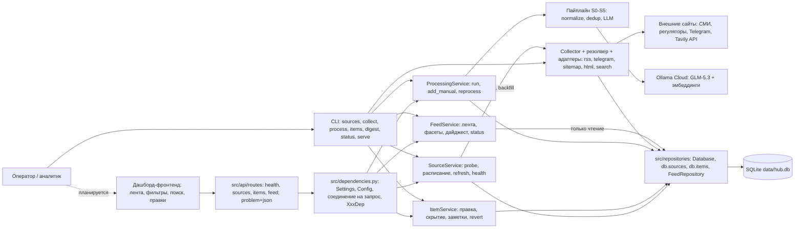
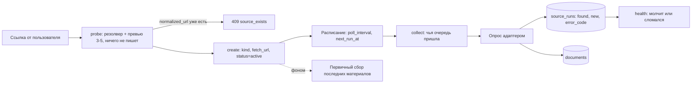
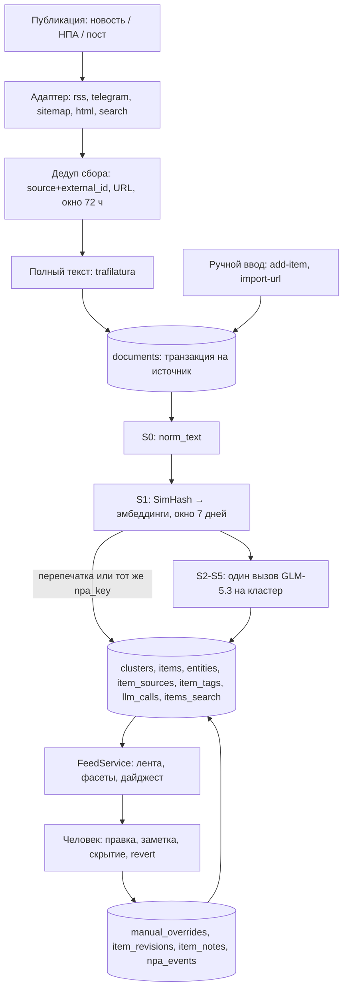
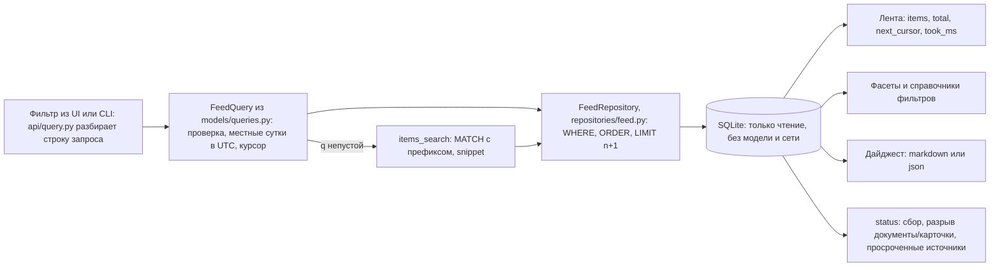

# Целевая архитектура

## Что должно быть:

- Основные компоненты; 
- Поток данных от входящего тикета до ответа/маршрутизации; 
- Синхронные и асинхронные части; 
- Хранилища; 
- Места вызова сервисов и интеграций; 
- Участие человека и запасные пути. 
- Использовать Mermaid для вспомогательных диаграмм.

*Статус на 05.09.2026: реализованы этап 1.1 «Сбор данных» (`src/sources`, `src/cli.py`: пять адаптеров — rss, telegram, sitemap, html, search; пул источников пересобран 03.09.2026 под профиль GS Labs), этап 1.2 «Интеллектуальная обработка» (`src/processing`, `src/services/processing_service.py`), этап 1.4 «Управление источниками и данными» (`src/api`, `src/services/source_service.py`, `src/services/item_service.py`, `src/sources/scheduler.py`) и серверная часть этапа 1.3 «Единый интерфейс» (`src/services/feed_service.py`, `src/repositories/feed.py`, читающие маршруты `/api/v1`, миграция БД до `PRAGMA user_version = 4`). 05.09.2026 бэкенд перестроен в слои Model-Service-Repository по образцу шаблонного проекта: запрос идёт `src/api/routes/*` → `src/services/*` → `src/repositories/*`, и каждый слой знает только слой под собой; пакеты `src/storage/` и `src/feed/`, модули `src/sources/manage.py`, `src/processing/service.py` и `src/common.py` больше не существуют. Схема БД (v4) и прежние маршруты не менялись, добавились `GET /health`, `GET /health/ready` и `POST /sources/{id}/refresh`. Впереди фронтенд дашборда: экраны рисуются поверх готового читающего слоя, и всё, что ниже помечено «планируется», относится к нему. Осознанные ограничения названы там, где они влияют на схему: вложения (PDF и другие файлы) не читаются вовсе, длинные документы уходят в модель обрезанным префиксом, золотой набор для метрик качества ещё не размечен, а шаг S6 (проверка саммари на опору в оригинале) вместе с модулем `grounding.py` удалён при коммите 1.2 — от него в схеме остался только флаг `needs_review`, который сейчас никто не выставляет.*

## Основные компоненты

- **Резолвер источника + адаптеры** (`src/sources/resolver.py`, `scraper_*.py`). Пользователь вводит один URL, резолвер сам выбирает способ опроса: `tavily://search?q=…` → search (сохранённый запрос Tavily); любая другая не-http схема (например, `manual://import`) → manual — оба без единого HTTP-запроса; `t.me/…` → telegram; URL, похожий на ленту и разбирающийся feedparser'ом → rss; `<link rel="alternate">` или типовые пути (`/rss`, `/feed`, …) → rss; `robots.txt` / `sitemap.xml` с `lastmod` → sitemap; иначе → html (diff ссылок). Пять адаптеров за одним интерфейсом `Adapter.fetch(source, state, client, *, now, since, backfill) -> FetchResult` возвращают единый `RawDocument` (у `manual` адаптера нет — его наполняют руками); это и есть механика «добавления источника по ссылке» из требования 1.4.
- **Поисковый источник Tavily** (`scraper_search.py`, HTTP-обёртка `scraper_llm.py`). Источник kind `search` хранит не адрес, а запрос: `fetch_url = tavily://search?q=…&domains=…&days=N&topic=news|general&summary=1` (канонический, поэтому одинаковый запрос → тот же источник). Каждое попадание становится обычным документом (текст страницы из ответа Tavily после `clean_page_text`; если его меньше 400 символов — фрагменты Tavily плюс попытка trafilatura), а ответ Tavily — документом-дайджестом «Сводка: <запрос>» (`external_id` `summary:YYYY-MM-DD`, без URL, один на запрос в день). Дополнение к лентам, не замена: западные поисковые API плохо индексируют gov.ru, поэтому качество держится на `domains`.
- **Коллектор и извлечение полного текста** (`collector.py`, `fulltext.py`). Опрашивает включённые источники, отсекает дубли, дотягивает текст анонсов через trafilatura (заголовок / автор / дата / текст) и пишет в SQLite; `HostLimiter` держит не больше 2 одновременных запросов к одному хосту (`per_host_concurrency`, gov.ru банит бурсты). Для kind `search` окно 72 ч не применяется — запрос ограничен собственным `days`. `collect_one(source, force=True)` опрашивает один источник на вызывающем потоке — на нём построена команда `search`.
- **Сервисы обработки и карточек** (`src/services/processing_service.py`, `item_service.py`). Слой «Service» разрезан по одному признаку — зовёт ли метод модель. `ProcessingService` — всё, что зовёт: `run()` (документы без карточки → карточки), `add_manual()`, `reprocess()`, `quality_summary()`; строится с провайдером (`provider` / `embedder`; в HTTP он приходит из `LLMProviderDep`, `None` без ключа — карточки заводятся деградированными, как и в CLI). `ItemService` — всё, что модели не касается: `get_item`, `edit_item`, `set_visibility` / `bulk_visibility`, `add_note`, `revert`, `revisions`, `add_npa_event`, плюс `record_model_revisions`, которым пользуется и `ProcessingService`. Бизнес-логики выше сервисов нет — CLI печатает результат, маршрут сериализует его через `response_model`.
- **Пайплайн S0–S5** (`normalize.py`, `dedup.py`, `pipeline.py`, `profile.py`). S0 — чистка HTML и boilerplate, результат в `documents.norm_text`; S1 — SimHash 64 бита по словесным 3-граммам плюс косинус по эмбеддингам среди кандидатов окна 7 дней; S2–S5 — один structured-output вызов на кластер: тип (`НПА` | `Новость`), саммари 3–5 предложений, сущности «кто / что / когда / последствия», приоритет (высокий / средний / низкий) с `relevance_score` и `reasoning`, теги (регуляторика / репутация / конкуренты / тренды / господдержка-льготы). Профиль компании (ООО «Цифра» / GS Labs) подставляется в промпт как версионируемый фрагмент — именно он решает, что для компании `high`. Шага S6 (проверка каждого предложения саммари на опору в оригинале) в коде нет: модуль удалён вместе с пайплайном 1.2, и вместо него работает только семантический разбор ответа с одним корректирующим ретраем.
- **Провайдер модели** (`src/processing/llm.py`). Протоколы `LLMProvider` / `EmbeddingProvider` и реализация `OllamaProvider` — единственный модуль репозитория с `import ollama`. Ошибки разделены: `LlmConfigError` (401/403/404 — неверный ключ или тег модели) останавливает прогон, `LlmTemporaryError` (429/5xx/сеть) уходит в повторы и затем в деградацию. В HTTP-процессе провайдер один на процесс: `get_llm_provider()` под `lru_cache` — один httpx-клиент на все рабочие потоки, `None` без ключа; закрывает его `lifespan`, а не сервис запроса.
- **Сервис источников и расписание** (`src/services/source_service.py`, `src/sources/scheduler.py`). `SourceService`: `probe()` (резолвер + превью 3–5 материалов + проверка «такой уже есть» по `normalized_url`), `create / update / pause / resume / soft_delete / restore / health` и новый `refresh(source_id, collector)` — синхронный внеочередной опрос, возвращает `SourceRun`; за `POST /api/v1/sources/{id}/refresh` и командой `sources refresh` стоит один и тот же метод. Функция модуля `run_backfill(config, paths, source_id)` — цель `BackgroundTasks` после `POST /sources`: открывает своё соединение и зовёт `Collector.collect_one`; при переносе исправлен порядок аргументов `Collector(config, paths, db)`, из-за которого первичный сбор раньше молча пропускался. `scheduler.py` не менялся — весь планировщик в одном модуле: у источника свой `poll_interval` (15m / 1h / 6h / 24h) и `next_run_at`, выбор «чья очередь» — один `SELECT` (`sources.due`), после опроса `next_run_at` пересчитывается.
- **Читающий слой ленты** (`src/services/feed_service.py`, `src/repositories/feed.py`; реализовано, 1.3). `FeedService` — только чтение: `items`, `facets`, `filters`, `documents`, `digest`, `status`. Ни одной записи в базу и ни одного обращения к модели или к сети — на этом держится бюджет «лента и фильтры быстрее секунды» (приёмка: серия запросов чтения не меняет `PRAGMA data_version`). Форма фильтра — `FeedQuery` / `DocumentQuery` в `src/models/queries.py`, одна на CLI и HTTP (разбор дат, курсор; нечисловой `limit` или `source_id` теперь 400 `validation_error`, а не 500); строку запроса в неё разбирает `src/api/query.py`. Весь SQL чтения — условия, порядок, `LIMIT n+1`, счётчики фасетов, подготовка `MATCH` для FTS5 — живёт за контрактом `FeedRepository` в `src/repositories/feed.py` (`SqliteFeedRepository`); сервис только собирает ответ с курсором и фактическим `took_ms`, а `src/services/digest.py` рендерит выгрузку. Отдельный сервис, а не метод `ProcessingService`, потому что ответственность другая: тот пишет карточки и зовёт модель, этот только читает.
- **HTTP-API** (`src/main.py`, `src/api/`). `create_app()` в `src/main.py` — фабрика без экземпляра на уровне модуля (uvicorn получает `src.main:create_app --factory`, поэтому импорт модуля в тестах не читает `.env` и не открывает базу): `lifespan`, `CORSMiddleware` из `Settings.cors_origins`, единый перевод ошибок и префикс `/api/v1` (`Settings.api_prefix`), навешенный один раз на `api_router`. `src/api/__init__.py` собирает `api_router` из `routes/health.py` (`GET /health`, `GET /health/ready`), `routes/sources.py`, `routes/items.py` и `routes/feed.py` (`/filters`, `/documents`, `/digest`, `/status`); маршруты — тонкие обёртки: разобрать тело или строку запроса (`src/api/query.py`) и позвать метод сервиса, бизнес-логики в обработчиках нет. Литеральные пути `/items/facets` и `/items/bulk` объявлены раньше `/items/{item_id}` в том же файле, поэтому порядок подключения роутеров больше ничего не решает. Ошибки — `application/problem+json` (RFC 7807; `src/api/problem.py`: `PROBLEM_JSON`, `TITLES`, `problem()`) с расширениями `code` и `details`, чтобы UI ветвился по коду, а не по тексту. Источник кодов — иерархия `src/exceptions.py` без единого импорта фреймворка: `AppError(detail, details)` с атрибутами класса `status_code` / `code`, семейства `SourceError` / `ItemError` / `QueryError` (их ловит CLI) и листья `SourceValidationError` 400, `SourceExistsError` 409, `SourceNotFoundError` 404, `UnsupportedSourceError` 422, `NetworkUnreachableError` и `TelegramPreviewUnavailableError` 502, `ItemValidationError` 400, `ItemNotFoundError` 404, `PossibleDuplicateError` и `NothingToRevertError` 409, `QueryValidationError` и `InvalidCursorError` 400, `RepositoryUnavailableError` 503; таблицы `STATUS_BY_CODE` больше нет — статус живёт на классе. Обработчики в `create_app()`: `AppError` → problem+json по классу, `RequestValidationError` → 422 `validation_error`, `HTTPException` — как есть, любое другое исключение → 500 без трассы в ответе. `import fastapi` встречается в `src/api/`, `src/main.py` и `src/dependencies.py` — это раскладка шаблона и названное отклонение от конституции («только под `src/api/`»); `src/exceptions.py`, сервисы и репозитории фреймворка не знают. Запуск — `python -m src serve [--reload]` (или `uvicorn src.main:create_app --factory`); адрес и порт — из `Settings` (`HOST`, `PORT` в `.env`, по умолчанию `127.0.0.1:8000`), `/docs` и `/openapi.json` — при `DOCS=true`; у каждого маршрута есть `response_model`, поэтому схема теперь документирует и ответы.
- **Связывание и конфигурация** (`src/dependencies.py`, `src/config.py`). Слои собираются в одном месте — `dependencies.py`: провайдеры и псевдонимы `Annotated[..., Depends()]` (`SettingsDep`, `ConfigDep`, `PathsDep`, `DatabaseDep`, `LLMProviderDep`, `TavilyKeyDep`, `CollectorDep`, `SourceServiceDep`, `ItemServiceDep`, `ProcessingServiceDep`, `FeedServiceDep`, `HealthServiceDep`); маршрут объявляет `service: SourceServiceDep` и сам `Depends(...)` не пишет. `config.py` держит две конфигурации: YAML-`Config` (замороженные dataclass'ы, домен — сбор, Telegram, Tavily, модель, пайплайн; `ApiConfig` — только `timezone`) и pydantic-settings `Settings` (параметры процесса из окружения и `<HUB_ROOT>/.env`). Что где читается — в «Местах вызова сервисов и интеграций».
- **Модели, репозитории и CLI** (`src/models/`, `src/repositories/`, `src/cli.py`, `src/utils.py`). `src/models/domain.py` — доменные dataclass'ы (не менялись), `queries.py` — `FeedQuery` / `DocumentQuery`, `requests.py` — pydantic-схемы тел запросов с `extra="forbid"`, `responses.py` — pydantic-схемы ответов с `from_domain()` на каждый dataclass; сервисы и репозитории pydantic не импортируют. `src/repositories/database.py` — фасад `Database`: соединение, PRAGMA, миграции по `PRAGMA user_version` (v4, не менялась), `ping()` для readiness и репозитории атрибутами (`db.sources`, `db.documents`, `db.items`, `db.source_runs`, `db.notes`, `db.tags`, `db.search`, … — имена прежние); реализации разложены по агрегатам — `sources.py`, `documents.py`, `items.py`, `processing.py`, `feed.py`, а `repository_interface.py` держит ABC-контракты только для того, чем пользуются HTTP-сервисы: `SourceRepository`, `DocumentRepository`, `ItemRepository`, `FeedRepository`. SQLite `data/hub.db` — единственное место состояния (источники и их расписание, документы, курсоры, история прогонов, карточки, правки и телеметрия модели). CLI и HTTP-API равноправны и зовут одни и те же сервисы: сбор — `collect [--watch --interval]`, `sources probe|add|list|pause|resume|remove|restore|health|refresh|resolve|seed`, `search`, `discover`, `import-url`, `docs`; обработка и карточки — `process`, `items`, `item`, `edit`, `hide`, `unhide`, `note`, `revert`, `revisions`, `add-item`, `reprocess`, `npa-event`, `profile`, `quality`; чтение и выгрузка (1.3) — `items` с фильтрами по источнику, диапазону дат, статусу НПА, нескольким приоритетам и тегам, `docs --unprocessed`, `digest`, `status`; API — `serve` (uvicorn по строке фабрики, `--reload` для разработки). `src/utils.py` заменил `src/common.py`: те же помощники (`load_env_secret`, даты, хэши) плюс `configure_logging`.
- **Планируется:** фронтенд дашборда — экраны ленты, фильтров, поиска, карточки, дайджеста и шапки состояния поверх готовых `/api/v1/sources`, `/api/v1/items`, `/items/facets`, `/filters`, `/documents`, `/digest`, `/status` (контракты: `specs/003-unified-interface/contracts/rest-api.md`, `specs/002-management-sources/contracts/rest-api.md`), а не вторая реализация логики.

## Поток данных: от входящей публикации до ленты

*В шаблоне это «поток от входящего тикета до ответа/маршрутизации». Тикетов в продукте нет: единица потока — публикация (новость / НПА / пост Telegram-канала), а «ответ и маршрутизация» — карточка в ленте с категорией и приоритетом.*

- **Заведение источника: ссылка → probe → источник → расписание (реализовано, 1.4).** Пользователь вставляет один URL. `probe()` гоняет его через тот же резолвер, что и сбор, и ничего не пишет в БД: возвращает тип, найденный `feed_url`, превью 3–5 материалов, `already_exists` по `normalized_url` (три написания канала — `t.me/x`, `t.me/x/`, `t.me/s/x` — это один источник) и предупреждения (`paywall_suspected`, `bot_protection`, `empty_feed`, `no_dates`, `unsupported_source`). `create()` сохраняет источник со `status = 'active'`, `poll_interval` (по умолчанию подсказанный по категории: регуляторы и Telegram — 1h, СМИ — 6h, ручной ввод — 24h) и `next_run_at = now`; повтор по `normalized_url` — 409 `source_exists`, а не второй экземпляр, а тот же адрес после мягкого удаления `create()` восстанавливает (`_revive`), потому что собранное привязано к старому `source_id`. Бюджет `probe` — до 10 с (плановый, из `plan.md`): один запрос к источнику плюс превью.
- **Сбор (реализовано).** Каждый тик (`collect --watch --interval 900`, то есть 15 минут — ориентир task.md «материал в ленте за 15 минут, сайты регуляторов — до часа») коллектор опрашивает каждый включённый источник его адаптером: RSS — условный GET по ETag / Last-Modified (на втором smoke-прогоне все RSS-ленты с ETag ответили 304), Telegram — только посты после курсора `last_post_id` (веб-превью — до 5 страниц `?after=` за тик, MTProto — до `max_posts`), sitemap — записи новее курсора `lastmod` (до 5 дочерних sitemap, 200 URL), HTML — ссылки, которых ещё нет в `seen_urls`, search — один POST к Tavily: первый запуск / `--force` / `--backfill` спрашивают последние `days`, дальше `start_date` = день предыдущего прогона − 1 (курсор `since`; перекрытие на сутки, потому что даты Tavily — UTC-дни), ровно одна граница свежести на запрос; `include_raw_content=text`, `include_answer=advanced` при `summary=1`, `country` (только `topic=general`) и `language` из `config.yaml` (`language: ru` — иначе сводка приходит по-английски, но и с ним Tavily соблюдает язык не всегда: «Сводка» может вернуться по-английски).
- **Дедуп, полный текст, сохранение (реализовано).** Отбрасывается всё, что уже есть по `(source_id, external_id)` или по URL (правило по URL не трогает документы без пути — «Сводку» search и ленты, где все записи ведут на одну посадочную); на первом запуске берутся материалы не старше 72 ч (`date_window_hours`) — кроме kind `search`, где окно задаёт сам запрос (`days`); недатированные остаются (страницы НПА часто без даты), не больше 50 новых на источник за проход (`max_new_per_source`). Для анонсов полный текст дотягивается trafilatura (до 20 000 символов). Запись — одна транзакция на источник: документы + ETag/курсор + `fetch_state` вместе, чтобы курсор не ушёл вперёд без документов. Smoke-прогон 02.09.2026 по прежнему пулу: 17/17 источников, 268 документов за первый проход, все три категории источников (СМИ, регуляторы, Telegram); второй проход — 0 новых. Прогон 03.09.2026 по новому пулу (scratch-БД, dev-машина за рубежом): `sources seed` — 41 источник, 32 включены; первый `collect` — 538 новых документов, 31 из 32 включённых источников OK (Кабельщик, sitemap — таймаут), все три категории (СМИ, регуляторы, Telegram) плюс Telegram-зеркала, ≈ 7 мин 20 с; второй `collect` — Ведомости 304 Not Modified, ТАСС и Коммерсантъ по +50 (`max_new_per_source` добирает 72-часовое окно), остальное 0 новых; после двух проходов 759 документов = 759 уникальных URL = 759 уникальных пар `(source_id, external_id)`. `search`: новостной запрос по `@media` — 6 попаданий + «Сводка», `--general` по gov.ru-доменам — 19 попаданий (`start_date`, `country`); `scripts/happy_path_pr.sh` (4 попадания, одно уже известно через RSS Телеспутника, «Сводка») и `scripts/happy_path_gr.sh` (18 попаданий СОЗД / Минцифры + «Сводка» по-русски) отработали с кодом 0, повторный запуск PR идемпотентен (только новая «Сводка»).
- **Опрос по расписанию и история прогонов (реализовано, 1.4).** Чья очередь на тике, решает `next_run_at`: `Collector.run(due_only=True)` берёт только источники со `status = 'active'`, у которых срок пришёл, и после опроса сдвигает `next_run_at` на `poll_interval`; смена интервала пересчитывает срок немедленно, а не с конца текущего периода. Каждый опрос — строка в `source_runs`: начало и конец, `items_found`, `items_new`, машинный `error_code` (`timeout`, `http_error`, `network_unreachable`, `parse_error`, `telegram_preview_unavailable`, иначе `error`) и текст ошибки; `sources health <id>` и `GET /api/v1/sources/{id}/health` показывают её рядом с `consecutive_failures` и `last_success_at`. Это ответ на отдельно подсвеченный заказчиком риск: по одному «последнему состоянию» в `fetch_state` не отличить «источник молчит» от «источник сломался неделю назад». Открытый хвост: `due_only` ещё не включён в цикл `collect --watch` — тик пока прогоняет все активные источники раз в `--interval` (900 с по умолчанию), хотя расписание уже ведётся и пересчитывается.
- **Нормализация и схлопывание дублей (реализовано, S0–S1).** `process` берёт документы, у которых нет строки в `item_sources` (то есть нет карточки), чистит текст в `norm_text` и ищет, к чему документ примыкает: сначала SimHash (расстояние Хэмминга ≤ `processing.simhash_distance`, сейчас 8 — правка-перепечатка даёт 2–4, разные документы от 18), затем косинус по эмбеддингам (порог 0.86) — только среди уже окарточенных документов окна 7 дней. Перепечатка не тратит вызов модели: она добавляется в `item_sources` существующей карточки и увеличивает `clusters.size`. Для НПА склейка по похожести запрещена — документ прикрепляется к долгоживущей карточке только по совпадению `items.npa_key` (номер СОЗД, id проекта на regulation.gov.ru, номер акта).
- **Саммаризация, категоризация, приоритизация (реализовано, S2–S5).** Один structured-output вызов на кластер (схема уходит параметром `format`, поэтому синтаксически битого JSON не бывает) даёт тип, саммари в 3–5 предложений, сущности, приоритет с обоснованием и теги; ответ разбирается своим кодом, невалидный по смыслу возвращается модели один раз с указанием причины. Отдельной проверки каждого предложения на опору в оригинале в коде нет (S6 удалён), поэтому «в саммари нет фактов, которых нет в оригинале» из task.md сегодня держится на промпте и на правке аналитика, а не на автоматическом фильтре. Ориентир task.md — 10–15 с на публикацию; факт по каждому вызову пишется в `llm_calls` (модель, токены, латентность, статус). Длинные документы уходят обрезанным префиксом, а не map-reduce: `evidence_offsets` — координаты в `norm_text`, пересказ их ломает, поэтому такие карточки помечаются и получают `confidence × 0.7`.
- **Запись карточки (реализовано).** Одна транзакция на кластер: `clusters` → `items` → `entities` → `item_sources` → `item_tags` → `llm_calls`, для НПА плюс первое событие в `npa_events`. Всё, что записала модель в поля карточки, дополнительно ложится строкой в `item_revisions` с `source_of_change = 'llm'` — иначе после правки человека версию модели было бы неоткуда взять. Повторный `process` без новых документов создаёт 0 карточек и 0 вызовов модели; `--force` перечитывает документы, но окарточенные идут через `reprocess`, а не плодят дубли.
- **Правки (реализовано).** Лента и её фильтры вынесены в читающий слой (следующие четыре пункта), а `item` показывает карточку целиком с источниками, хронологией НПА, заметками, тегами, историей правок и «что предлагает модель» по каждому полю. Правка (`edit`, `PATCH /items/{id}`) помечает поле в `items.manual_overrides`, пишет «было/стало» в `item_revisions` с причиной (`hallucination` / `wrong_focus` / `wrong_priority` / `other`) — и переобработка это поле больше не трогает. Скрытие (`hide --scope feed|digest`), мягкое удаление, заметки (`note`), ручное добавление (`add-item`) и возврат версии модели (`revert`) работают одинаково из CLI и из API; фронтенд добавит к ним экраны, а не вторую логику.
- **Чтение: фильтр → выборка → лента и фасеты (реализовано, 1.3).** Фильтр из CLI или из строки запроса (`src/api/query.py`) собирается в `FeedQuery` (`src/models/queries.py`) — единственную проверенную форму (тип, статус НПА, приоритеты «ИЛИ», теги «И», источники, диапазон дат, порядок `published | priority | processed`, `limit` 1–200; нечисловой `limit` или `source_id` — 400, а не 500): описан один раз, поэтому фильтры двух поверхностей не могут разъехаться. Голая дата — это местные сутки по `api.timezone` (по умолчанию `Europe/Moscow`), развёрнутые и переведённые в UTC (в базе всё в UTC): иначе «за сегодня» молча теряет первые три часа московского утра — ровно те, ради которых делается утренний разбор; ISO-время со смещением берётся как прислано. Дальше `SqliteFeedRepository` (`src/repositories/feed.py`) собирает условия, сортировку тройкой ключей по убыванию (материал без даты уходит в конец через `COALESCE(published_at, '')`) и `LIMIT n+1`, а ответ несёт строки с `canonical_url` и источником, `total` по тому же срезу (раньше `GET /api/v1/items` возвращал общее число карточек — исправлено), `next_cursor` и фактический `took_ms`. Фасеты (`by_priority`, `by_type`, `by_source` до 20, `top_tags` до 15) считаются тем же WHERE, но отдельным эндпоинтом: счётчики нужны шапке один раз, а лента листается.
- **Постраничность курсором, а не смещением (реализовано, 1.3).** Курсор — ключи сортировки последней отданной строки плюс отпечаток фильтра, всё в base64. При притоке ~600 документов в сутки смещение давало бы и дубли, и пропуски: пока читают первую страницу, приезжают новые карточки и сдвигают окно. Курсор с чужим набором фильтров отклоняется как `invalid_cursor` (400), а не отдаёт молча другой срез; замер на реальной базе — 6 страниц по всей ленте, 38 уникальных id без повторов.
- **Поиск шире карточки (реализовано, 1.3).** Запрос `q` идёт не по саммари, а по строке индекса `items_search`, куда склеены заголовок, саммари, теги, значения сущностей и `norm_text` канонического документа, — слово, не попавшее в саммари из 3–5 предложений, всё равно находится. Пользовательский текст не передаётся в `MATCH` как есть: он разбивается на слова, каждое экранируется и получает `*` (морфологии у `unicode61` нет — замерено, что по `законопроект` FTS5 не находит «законопроекта», а по `законопроект*` находит; лемматизация словарём признана неоправданной). Найденная строка приходит со `snippet`, потому что совпадение может прийтись на текст, которого в карточке нет.
- **Необработанное, дайджест и сводка состояния (реализовано, 1.3).** `GET /api/v1/documents?unprocessed=true` и `docs --unprocessed` показывают собранное без карточки (сейчас 631 документ против 38 карточек) — материал доступен в пределах 15 минут после публикации, пока обработка догоняет; это не лента, у документа нет ни приоритета, ни типа, поэтому такие фильтры к нему неприменимы и отклоняются. `POST /api/v1/digest` и команда `digest` рендерят срез в markdown или json с группировкой по приоритету («высокий» впереди) и ничего не сохраняют: дайджест — это срез, а не сущность. `GET /api/v1/status` и команда `status` показывают время последнего сбора, разрыв «документов / карточек / без карточки», источники по статусам и просроченные с числом минут и последней ошибкой.

## Синхронные и асинхронные части

- **Сбор: пул потоков + запись в главном потоке.** Опрос источников идёт в `ThreadPoolExecutor` (`concurrency: 8`), рабочие делают только HTTP и разбор; вся запись в SQLite — в главном потоке по мере готовности результатов (`as_completed`). Полный текст дотягивается на этапе сохранения отдельным пулом (до 8 потоков на источник) под лимитом 2 запроса на хост. Расписание не выделено в демон: цикл `collect --watch` тикает по `--interval`, а кого опрашивать, решает `next_run_at` источника — планировщик это один индексированный `SELECT`, а не второй процесс (иначе на демо появляется вопрос, кто его перезапускает).
- **Telegram MTProto: asyncio внутри пула потоков (реализовано).** Telethon асинхронный, а коллектор — пул потоков, поэтому на прогон поднимается один фоновый event loop с одним подключённым клиентом, и рабочие потоки отдают ему работу через `run_coroutine_threadsafe`: параллельные запросы истории ограничены `telegram.concurrency` (2 — аккаунт лучше не разгонять), история одного канала — `telegram.request_timeout` (60 с), а `flood_sleep_threshold` (60 с) ограничивает ожидание FloodWait — более долгое становится ошибкой этого источника, а не паузой всего прогона. Клиент отключается в конце прогона (`Collector.close` из `finally` в `run`); чтение пассивное — каналы не подписываются, `iter_messages` не двигает указатель прочитанного.
- **Синхронно для пользователя:** `sources probe` и `sources add` (резолвер: основной запрос с таймаутом 30 с, пробы типовых путей — 8 с, чтобы медленный сайт не подвешивал команду; превью — один запрос адаптером, бюджет 10 с; `tavily://` и другие не-http схемы закрываются без HTTP), `sources refresh` / `POST /api/v1/sources/{id}/refresh` и `search` (`collect_one` на вызывающем потоке: один запрос с таймаутом 30 с плюс дотяжка тонких страниц), `import-url` (страница → trafilatura → БД), а также весь читающий слой и правка карточек: `items`, `item`, `docs`, `digest`, `status`, `edit`, `hide`, `note`, `revert`, `npa-event`, `quality` работают только с БД, без обращения к модели и к сети. Бюджет чтения — меньше секунды; факт на реальной базе (669 документов, 38 карточек, 53 источника) — единицы миллисекунд на ленту и фасеты, и он виден в поле `took_ms` каждого ответа, а не остаётся обещанием.
- **HTTP-слой синхронный, соединение живёт один запрос (реализовано, 1.4; уточнено при перестройке 05.09.2026).** Обработчики объявлены обычными `def`, поэтому FastAPI выполняет их в своём пуле потоков; соединение открывает зависимость `get_database` с `yield` (`DatabaseDep` в `src/dependencies.py`) и закрывает после ответа, в `app.state` оно не хранится. `Database` открывает SQLite с `check_same_thread=False`: FastAPI выполняет зависимость с `yield` и сам обработчик в разных потоках пула, но соединением по-прежнему пользуется один запрос последовательно — это смена потока между шагами, а не параллельный доступ. Открытие SQLite стоит микросекунды, WAL включён с 1.1; массовый писатель по-прежнему один (`collect --watch`), а короткие транзакции API живут с ним рядом под WAL и `busy_timeout` 5 с. Фонового здесь одно: первичный сбор после `POST /sources` (если запрошен `backfill_limit`) — `run_backfill` из `source_service.py` уходит в `BackgroundTasks` и открывает своё соединение, потому что соединение запроса к этому моменту уже закрыто; при переносе исправлен порядок аргументов `Collector`, из-за которого задача молча пропускала сбор (в CLI та же операция идёт синхронно, с выводом прогресса). `POST /sources/{id}/refresh`, напротив, синхронный: `CollectorDep` собирается на соединении запроса, `SourceService.refresh` зовёт `collect_one` и возвращает `SourceRun` прямо в ответе — для демо важно увидеть результат, а не лог. `lifespan` на старте читает `Settings` и `Config` (битый `config.yaml` — `ConfigError` при запуске, а не на первом запросе), открывает одно `Database`, чтобы прогнать миграции, и тут же закрывает его; на остановке закрывает кэшированный провайдер модели (`get_llm_provider()` под `lru_cache` — один httpx-клиент на весь процесс и все рабочие потоки). Читающие маршруты 1.3 живут в той же схеме и делают только `SELECT`, поэтому с писателем под WAL не конкурируют.
- **Обработка: та же схема разделения (реализовано).** S0 и S1 считаются на главном потоке (нормализация, SimHash, один батчевый запрос эмбеддингов на прогон), медленные вызовы модели идут в `ThreadPoolExecutor` с `processing.concurrency = 2` — как `per_host_concurrency` у коллектора: низкий параллелизм бережёт квоту облака. Все записи — на главном потоке, одна транзакция на кластер, поэтому SQLite остаётся однопоточным писателем. Внутри одного вызова модели ретраи синхронные: до двух повторов с экспоненциальной паузой (`llm.max_retries: 2`, `retry_backoff: 2 с`), таймаут запроса — `llm.request_timeout: 300 с` при бюджете 15 с на публикацию: запас на «размышляющую» модель, а не норма.
- **Быстрый и медленный путь разведены по командам.** Быстрый — `collect`: документ в базе через секунды после тика, виден в `docs` и в отставании обработки. Медленный — `process`: кластеризация и модель. Сбор от модели не зависит вообще; при недоступной модели `process` всё равно создаёт карточки, только деградированные. Обратное тоже верно: `items`, `item` и поиск читают только сохранённые поля и модель не зовут.
- **Раздельные интервалы вместо одного на всех (реализовано, 1.4).** У источника свой `poll_interval` из четырёх значений (15m / 1h / 6h / 24h); подсказка по категории: регуляторы и Telegram — час (ориентир task.md «сайты регуляторов — до часа»), СМИ — 6 часов, ручной источник — сутки. Поисковым запросам Tavily интервал стоит ставить руками пореже: каждый опрос стоит кредиты, а подсказка отнесёт их к СМИ. Планируется: тик `collect --watch` раз в 60 с с выборкой только тех, чья очередь пришла (`due_only`), и автозапуск `process` по факту появления новых документов — сегодня `process` запускает человек или cron.

## Хранилища

- **SQLite `data/hub.db`** — WAL, `foreign_keys`, `busy_timeout` 5 с, миграции по `PRAGMA user_version` (сейчас v4 — её добавила серверная часть 1.3). WAL выбран, чтобы дашборд мог читать, пока `collect --watch` пишет. Соединение открывается на прогон (CLI) или на запрос (HTTP) и закрывается после, с `check_same_thread=False` — почему, см. «Синхронные и асинхронные части». Код хранилища — пакет `src/repositories/`: `database.py` (фасад `Database`: PRAGMA, миграции `_MIGRATIONS` по `PRAGMA user_version`, `ping()` — `SELECT 1` для `/health/ready`), репозитории по агрегатам `sources.py`, `documents.py`, `items.py`, `processing.py`, `feed.py` и ABC-контракты в `repository_interface.py`; перестройка 05.09.2026 схему не тронула — `user_version` остался 4. PostgreSQL и pgvector отложены осознанно (`specs/001-processing-news/research.md`, R-01 и раздел «БД» спецификации): на текущем объёме FTS5 заменяет GIN, а вектора перебираются в Python за миллисекунды.
- **Таблицы:** `sources` (что ввёл пользователь + `kind` / `fetch_url`, выбранные резолвером, `status`, `normalized_url`, `poll_interval`, `next_run_at`, `category_hint`, `deleted_at`, `created_by`; `fetch_url` UNIQUE — поэтому повторный `search` с тем же запросом находит существующий источник, а не плодит новые); `documents` (нормализованный `RawDocument`: заголовок, анонс, текст, автор, вложения, `published_at`, `content_hash`; `UNIQUE(source_id, external_id)`, индекс по URL; у «Сводки» search URL пустой; колонка `hidden` осталась с 1.1 и никем не выставляется — скрытие живёт на уровне карточки); `fetch_state` (ETag, Last-Modified, JSON-курсор адаптера — `last_post_id` и `transport` у telegram, `lastmod` у sitemap, `since` / `days` у search, — `last_error`, `consecutive_failures`, `last_success_at`); `seen_urls` (что html-адаптер уже видел); `collect_runs` (история прогонов целиком, включая разовые `search`). `raw_html` по умолчанию не хранится (`store_raw_html: false`).
- **Таблицы обработки (миграция v2):** `clusters` (группа перепечаток, центроид, `size`, зарезервированный `has_divergent_opinions`), `items` (карточка: тип, `npa_status` / `npa_key`, саммари, приоритет, `relevance_score`, `reasoning`, `confidence`, теги, флаги `degraded` / `needs_review` / `date_estimated`, `model_name` / `prompt_version` / `profile_version`), `entities`, `item_sources` (карточка ↔ перепечатки, `is_canonical`), `npa_events` (хронология статусов, `created_by = system | user`), `item_revisions` (аудит правок: поле, было/стало, кто, когда), `company_profiles`, `prompt_versions`, `llm_calls` (телеметрия вызовов). Плюс три колонки в `documents`: `simhash`, `embedding` (`float32` BLOB), `norm_text` — последняя хранится потому, что `evidence_offsets` считаются именно по ней.
- **Таблицы управления (миграция v3):** `source_runs` — история опросов по источнику (начало, конец, `http_status`, `items_found`, `items_new`, `error_code`, `error_message`; ≈ 5 тыс. строк в сутки при 53 источниках и интервале 15 минут — оценка из `research.md`, чистка отложена); `item_notes` — заметки аналитика (несколько на карточку, с автором, во внешние API не уходят); `item_tags` — теги с флагом `is_manual`, источник истины при переобработке (`items.tags` остаётся денормализованной копией для ленты). Переименования и новые состояния: `items.edited_fields` → `manual_overrides`, `items.is_hidden` → `visibility` (`visible` / `hidden_feed` / `hidden_digest` / `deleted`) плюс `hidden_reason` и `origin` (`collected` | `manual`), `sources.enabled` → `sources.status` (`active` / `paused` / `error` / `deleted`), у `item_revisions` — `source_of_change` (`llm` | `human`) и `edit_reason`. Индексы под новые запросы: `sources(next_run_at) WHERE status='active'`, уникальный `sources(normalized_url)` среди неудалённых, `item_revisions(item_id, field, created_at DESC)` — по нему идут `revert` и показ «модель предлагает другое» в бюджете ленты < 1 с.
- **Поисковый индекс (миграция v4):** виртуальная таблица `items_search` (FTS5, `unicode61`, `prefix='2 3 4'`) — одна строка на карточку, `rowid = items.id`; в строку склеены заголовок, саммари, теги, значения сущностей и `norm_text` канонического документа, поэтому поиск идёт шире карточки. Триггеров нет намеренно: текст собирается из четырёх таблиц, и строка перестраивается целиком (`DELETE` + `INSERT`) в той же транзакции, что и запись карточки, — семь мест в двух сервисах: пять в `ProcessingService` (создание, присоединение перепечатки, привязка к НПА по `npa_key`, `add_manual`, `reprocess`) и два в `ItemService` (`edit_item`, включая теги, и `revert`). При миграции индекс наполняется одним проходом по существующим карточкам (`SearchRepo.rebuild_all`). Плюс два индекса под ленту: `item_sources(item_id, is_canonical)` и `items(type, priority)`. Старая `items_fts` (v2, триггеры по `title` и `summary`) осталась в схеме и обслуживает только `SqliteItemRepository.list` (контракт `ItemRepository`), которым живёт `quality` — долг на удаление, а не второй индекс ленты.
- **Сессия Telegram — второй файл SQLite (реализовано).** `data/<session_name>.session` (по умолчанию `telegram.session`) хранит ключ MTProto-сессии: это равно доступу к аккаунту, поэтому файл в `.gitignore` и не коммитится, а `api_id` / `api_hash` живут в `.env` (`TELEGRAM_API_ID`, `TELEGRAM_API_HASH`, выдаются на my.telegram.org), а не в `hub.db`. Заодно сессия кэширует резолвинг каналов, так что имя канала стоит одного запроса только на первом прогоне.
- **Планируется:** те же операции с экранов фронтенда поверх готового API; архивация новостей и принятых НПА по расписанию (`items.is_archived` зарезервировано и намеренно не слито с `visibility`: архив — конец жизненного цикла НПА, `deleted` — решение пользователя); заполнение `has_divergent_opinions` — колонка есть, но признак «разные позиции по одному событию» ещё не вычисляется.
- **Внешние хранилища не нужны:** вложения хранятся ссылками (`attachments`), кэш страниц — сама таблица `documents`. PostgreSQL (стек заказчика GS Labs) — на выбор при выходе за прототип, критерий — несколько писателей/сервисов; для одного процесса SQLite достаточно (промышленная нагрузка вне скоупа хакатона).

## Места вызова сервисов и интеграций

- **Внешние сайты (реализовано):** пул `sources.json` собран только из `context/sources_for_company.md` (профиль GS Labs): 41 источник — 14 СМИ (RSS: CNews, TAdviser, Коммерсантъ, ТАСС, Lenta.ru, Телеспутник, Habr, Ведомости; sitemap: Кабельщик), 9 регуляторов (три ленты API `publication.pravo.gov.ru/api/rss?block=government|federal_authorities|president`, government.ru, Роскомнадзор, ФНС — RSS; РФРИТ — sitemap; ФСБ — HTML-diff), 16 зеркал `t.me/s/<канал>`, 2 поисковых запроса; 32 включены. Низкоприоритетные и не подтверждённые из-за рубежа (РБК, D-Russia, КонсультантПлюс, RusCable, Forbes, ЦБ, Торгпред) засеяны с `"enabled": false`. Всё без ключей и учёток, кроме Tavily и Telegram-аккаунта для MTProto. Один общий `httpx.Client` на прогон, браузерный User-Agent, `Accept-Language: ru`, таймаут 30 с (`request_timeout`; поднят с 20, потому что Коммерсантъ, CNews и ТАСС из-за рубежа отвечают ~17 с), до 5 редиректов; ошибки не выбрасываются, а возвращаются в `FetchResult.error`. Операционное ограничение: gov.ru и часть СМИ ограничивают доступ с зарубежных IP — dev-стенд за рубежом видит таймауты, выключенные источники перепроверяются из РФ (`sources resolve`, `sources enable`).
- **Telegram: два транспорта, один kind (реализовано).** Источники `telegram` читаются через MTProto (Telethon, личный аккаунт оператора), если есть файл сессии, и через веб-превью `t.me/s/<канал>` в остальных случаях; выбор задаёт `telegram.mtproto: auto | off | only` в `config.yaml`, а нумерация постов у транспортов общая, поэтому `cursor.last_post_id` и сохранённые `external_id` переживают смену транспорта без повторного импорта и дублей (курсор помнит и сам транспорт — `cursor.transport`). MTProto добавляет каналы с выключенным превью, догоняние дальше пяти страниц `?after=` (`telegram.max_posts` за проход, `backfill_posts` при `--backfill`) и имена вложенных файлов — так видны ПДФ-дайджесты АРПП и РФРИТ; сами файлы не скачиваются, в `attachments` идут внешние ссылки плюс записи `file:<имя>`.
- **Tavily (реализовано, две роли)** — ключ `TAVILY_API` из `.env`, первая из двух платных интеграций. (1) `discover` — поиск кандидатов в источники, найденные сайты прогоняются через резолвер (`--add`); документов не создаёт. (2) Источники kind `search` — сохранённый запрос опрашивается `collect` наравне с лентами (`SearchAdapter` в `build_adapters`): до 20 результатов за запрос (потолок API), `days` / `country` / `language` по умолчанию из `config.yaml` (`tavily.days: 7`, `tavily.country: russia`, `tavily.language: ru`). Каждый опрос стоит кредиты (`include_answer=advanced` и `search_depth=advanced` — дороже базового), поэтому два засеянных запроса — «упоминания GS Labs / Триколор» (news, 7 дн., домены отраслевых СМИ) и «проекты НПА — ПО, ПД, КИИ» (general, 14 дн., regulation.gov.ru, СОЗД, pravo.gov.ru, government.ru, digital.gov.ru) — выключены по умолчанию. Отсутствие ключа — ошибка в `fetch_state` конкретного источника, а не падение прогона. Дополнение к лентам, не замена: западные поисковые API плохо индексируют gov.ru. Планируется: Yandex Search API для доменов регуляторов и обогащение карточки («кто ещё писал о законопроекте»).
- **Ollama Cloud (реализовано, вторая платная интеграция)** — `https://ollama.com`, модель `glm-5.3:cloud`, ключ `OLLAMA_API_KEY` из `.env` (в логи и в БД не попадает); тем же клиентом и ключом считаются эмбеддинги (`embed_model: embeddinggemma`, 768). Зовётся только из `process` и `reprocess` — никогда из чтения ленты. Вход — профиль компании плюс поля документа: заголовок, источник, дата и `norm_text`, обрезанный до `processing.max_chars = 12000`; для НПА этого хватает, потому что по Q&A нужна пояснительная записка, а не тело акта. Выход — ответ по JSON Schema (`format`), который дальше проверяется своим кодом. `analyst_note` в промпт не передаётся конструктивно: функция сборки промпта его просто не принимает. Смена провайдера (GigaChat, YandexGPT, self-hosted) — это новая реализация `LLMProvider` и другой `model` в конфиге, пайплайн не меняется; выбор модели и метрики — в `ml.md`.
- **HTTP-API — точка интеграции для дашборда и скриптов (реализовано, 1.4 и 1.3).** `/api/v1/sources` (probe, CRUD, пауза, мягкое удаление, restore, `refresh`, health), `/api/v1/items` (лента, правка, скрытие, заметки, ревизии, revert, ручное добавление, массовое скрытие под дайджест), читающие маршруты 1.3 — `/items/facets`, `/filters`, `/documents`, `/digest`, `/status` — и служебные `/health`, `/health/ready`; ошибки — problem+json с машинным `code`, схема — `/openapi.json` с `response_model` у каждого маршрута. Читающие маршруты не вызывают ни одной внешней интеграции: ни модели, ни Tavily, ни сайта-источника — только SQLite. Сам слой во внешний мир ходит четырьмя путями: `POST /sources/probe` (один запрос к источнику), фоновый первичный сбор после `POST /sources`, синхронный `POST /sources/{id}/refresh` (опрос одного источника на соединении запроса, в ответе — `SourceRun`) и `POST /items` с `run_llm: true` — единственный платный вызов модели из API и всегда явное действие пользователя. Авторизации нет (ИБ вне скоупа хакатона), но автор изменения пишется строкой (`sources.created_by`, `item_revisions.actor`, `item_notes.author`).
- **Связывание слоёв — только `src/dependencies.py`.** Маршрут объявляет `service: SourceServiceDep` и никогда не пишет `Depends(...)` сам; все провайдеры и псевдонимы `Annotated[..., Depends()]` живут в одном модуле: `SettingsDep`, `ConfigDep`, `PathsDep`, `DatabaseDep` (соединение на запрос через `yield`, закрывается после ответа), `LLMProviderDep` (`get_llm_provider()` под `lru_cache` на весь процесс, `None` без ключа; владелец — `lifespan`), `TavilyKeyDep`, `CollectorDep` (коллектор на соединении запроса — для `refresh`), `SourceServiceDep`, `ItemServiceDep`, `ProcessingServiceDep`, `FeedServiceDep`, `HealthServiceDep`. Новый сервис — новый провайдер и псевдоним здесь, а не `Depends` в маршруте. CLI собирает те же сервисы руками (`Database(paths.db_path)` + `SourceService(config, db)` и т. д.) — второй потребитель того же слоя, минуя FastAPI.
- **Две конфигурации: `Settings` из окружения и `Config` из `config.yaml`.** `Settings` (pydantic-settings, `src/config.py`) — только параметры процесса: `app_name`, `environment` (`local | dev | prod`), `debug`, `api_prefix` (`/api/v1`), `host`, `port`, `docs`, `cors_origins` (JSON-список), `log_level`, `hub_root`; читаются из окружения и `<HUB_ROOT>/.env`, причём `get_settings()` выбирает файл `.env` по `HUB_ROOT` до создания `Settings` — строка `HUB_ROOT=` внутри `.env` не читается, иначе тесты на временном корне подхватили бы `.env` разработчика. `get_settings()`, `get_paths()`, `get_config()` — провайдеры без аргументов под `lru_cache`. `Config` (замороженные dataclass'ы) остаётся за доменом — сбор, Telegram, Tavily, модель, пайплайн, — а `ApiConfig` держит только `timezone`. Секреты в `Settings` не моделируются: имена переменных по-прежнему задаёт YAML (`llm.api_key_env`, `tavily.api_key_env`, `telegram.api_id_env` / `api_hash_env`), а читает их `utils.load_env_secret` из того же `.env`. Названные отклонения от конституции: pydantic-`Settings` рядом с dataclass-`Config` (только параметры развёртывания), секреты через `load_env_secret`, а не через `Settings`, и `import fastapi` в `src/main.py` и `src/dependencies.py`, а не только под `src/api/`.
- **Docker и compose (реализовано, 05.09.2026).** `src/Dockerfile` — многостадийная сборка на `uv` (образ `uv` → builder с `uv sync --locked --no-dev` → тонкий runtime на `python:3.13-slim`), пользователь `app` без root, в образ идут `src/`, `config.yaml`, `sources.json`; `.dockerignore` не пускает в слой `.env`, `data/`, `.venv`, тесты и документацию. `CMD uvicorn src.main:create_app --factory --host 0.0.0.0 --port 8000`, `HEALTHCHECK` раз в 30 с дёргает `/api/v1/health/ready`. `docker-compose.yaml` — один сервис `api`: `HUB_ROOT=/app`, `HOST=0.0.0.0`, `.env` подключается как необязательный `env_file`, тома `./data` (SQLite и WAL переживают пересборку), `./src:ro` с `--reload` для разработки, `./config.yaml` и `./sources.json` только на чтение. Отдельного воркера в compose нет: сбор и обработка по-прежнему запускаются командами CLI (`make watch`, `make process`).
- **Проверки живости для оркестратора (`src/services/health.py`).** `GET /api/v1/health` — `liveness()`: всегда `ok` и без ввода-вывода, процесс жив. `GET /api/v1/health/ready` — `readiness()`: `Database.ping()` (`SELECT 1` на соединении запроса); если хранилище не отвечает — `status: degraded` и HTTP 503 с тем же телом (`app`, `version`, `environment`, `checks.repository`), чтобы оркестратор вывел экземпляр из ротации, а человек прочитал причину. Это не замена `GET /api/v1/status`: тот отвечает про продукт (последний сбор, разрыв документов/карточек, просроченные источники), эти — про процесс и его зависимость.
- **Отдельные адаптеры (планируется):** regulation.gov.ru (Next.js-приложение: RSS-подписка и Open Data API требуют своего адаптера) и СОЗД Госдумы (публичного API нет; карточка законопроекта со стадиями и версиями) — до тех пор оба закрыты поисковым источником «проекты НПА» по домену; reestr.digital.gov.ru (только поиск с URL-параметрами — мониторинг включений своих и конкурентных продуктов в реестр ПО). Без адаптера, но с оговоркой на сеть: digital.gov.ru и ФСТЭК (таймаут из-за рубежа / сертификат российского УЦ на bdu.fstec.ru), сайты ComNews и RSpectr (не отвечают из-за рубежа; их Telegram-зеркала включены), Broadcasting.ru (TLS обрывается из-за рубежа). Все 8 — в `excluded` в `sources.json` с причиной. publication.pravo.gov.ru закрыт штатным RSS-адаптером через `/api/rss?block=…` (API отвечает только по http).

## Участие человека и запасные пути

- **Резолвер деградирует ступенями:** ленты нет → sitemap с `lastmod` → diff ссылок HTML; недоступный сейчас сайт всё равно добавляется как html с пометкой «unreachable now»; приватная Telegram-ссылка и любая не-http схема — как `manual` без HTTP (сломанный `tavily://` — тоже manual с пометкой). `sources add --kind --fetch-url` закрепляет адрес руками — так закреплён весь `sources.json` (адреса лент проверены вручную 03.09.2026, `sources seed` не ходит в сеть), `sources resolve` перепроверяет и сбрасывает курсор.
- **Сбой одного источника не останавливает прогон:** ошибка пишется в `fetch_state.last_error` / `consecutive_failures`, а сам опрос — строкой в `source_runs` с машинным `error_code`, поэтому видно не только «сломано сейчас», но и когда сломалось; `sources pause` выключает шумный, дорогой или упавший источник, `collect --force` / `--backfill` перечитывают, `sources refresh` (в API — `POST /sources/{id}/refresh`) опрашивает один источник вне очереди. Разовый `search` без `--save` намеренно оставляет источник на паузе: его можно повторить, включить (`sources resume`) и видеть в `sources list`. Сайты, которые резолверу не по зубам, живут в `excluded` с причиной, а не молча.
- **Удаления нет нигде — ни у источника, ни у карточки (реализовано, 1.4).** `sources remove` переводит источник в `status = 'deleted'` и проставляет `deleted_at`: документы и карточки остаются (НПА живёт дольше ссылки, по которой пришёл), `restore` возвращает источник в работу; `--purge-items` не удаляет, а прячет его карточки в `hidden_feed`. Если у источника были неархивные НПА, сервис отдельно предупреждает: карточки останутся, но перестанут обновляться. У карточки то же самое через `visibility`, и скрытие действует на ленту и на дайджест по-разному: `hidden_feed` убирает из ленты, `hidden_digest` — только из выгрузки, а в ленте карточка остаётся, `deleted` — мягкое удаление. Из ленты по умолчанию уходят лишь `hidden_feed` и `deleted` (исправлено в 1.3: раньше фильтр оставлял только `visible`, и подготовка адресной выжимки чистила ленту всем сразу, а лента одна на всех), `--include-hidden` возвращает всё, а дайджест исключает `hidden_digest` и `deleted` всегда, что бы ни просили фильтры. Скрытие не влияет на дедупликацию: скрытая карточка остаётся якорем своего кластера, иначе перепечатки начали бы плодить новые карточки.
- **Telegram: вход руками один раз, дальше транспорт деградирует сам.** Авторизация — разовый интерактивный шаг (`python -m src telegram login`: телефон, код из Telegram, пароль 2FA, если включён), `telegram status` показывает ключи, файл сессии и режим, `telegram logout --yes` удаляет сессию; без этого шага ничего не ломается — сбор продолжается через веб-превью. В режиме `auto` сбой по одному каналу откатывает на превью только этот канал, а сбой уровня сессии (нет сессии, отозван ключ) защёлкивается на весь прогон, чтобы остальные каналы не стучались в мёртвое соединение; `only` превращает и то и другое в ошибку источника, `off` к MTProto не обращается вовсе.
- **Ручной ввод — полноправный источник (реализовано, 1.4):** встроенный источник «Ручной импорт» (`kind=manual`, `fetch_url=manual://import`; адаптера нет, `collect` его пропускает), `import-url` для «прочитай вот это» и `add-item` / `POST /api/v1/items` для материала, которого в источниках не было — дайджесты правового комитета АРПП приходят файлами по понедельникам. Материал без ссылки валиден: достаточно заголовка. Дубль ловится сначала по нормализованному URL, потом по SimHash (эмбеддинги в этой установке недоступны — Ollama Cloud отвечает 401 на `embed`) и возвращается как 409 `possible_duplicate` с найденной карточкой и мерой близости; настоять можно `--force`. Карточка получает `origin = 'manual'`, ручной НПА — первое событие в `npa_events` с `created_by = user`; без модели (`--no-llm` или провайдер недоступен) она создаётся деградированной, но не теряется.
- **Человек ранжирует, система подсказывает (реализовано).** Модель даёт грубый уровень «релевантно / нерелевантно, молния / не молния» и обязательный `reasoning` в 1–2 предложения — по нему видно, почему карточка наверху. Ошибки асимметричны: при пограничной релевантности (0.35–0.5) или `confidence < 0.5` приоритет поднимается на ступень и никогда не понижается — пропустить критичное дороже, чем показать лишнее.
- **Правка аналитика сильнее пересчёта (реализовано).** `edit` меняет заголовок, саммари, тип, приоритет, теги и статус НПА; изменённое поле попадает в `items.manual_overrides`, «было/стало» с причиной — в `item_revisions`, и следующий `reprocess` это поле не трогает (снять защиту можно только явным `--drop-human-edits`). Ручные теги живут в `item_tags` с `is_manual = 1` и переобработку тоже переживают. `npa-event` добавляет событие в хронологию руками (`created_by = user`), причём статус карточки двигается только вперёд — ретроспективная публикация не откатит дело к «анонсу». Смена профиля компании архив не пересчитывает: только явный `reprocess`.
- **Правка обратима, а заметка — не саммари (реализовано, 1.4).** Всё, что пишет модель, ложится в `item_revisions` с `source_of_change = 'llm'` — в том числе для полей, закрытых правкой человека, поэтому `revert --field summary|title|priority|tags` возвращает последнюю версию модели одним действием, а на карточке видно «модель предлагает другое». Если модель поле никогда не трогала, `revert` честно отвечает 409 `nothing_to_revert`, а не подставляет пустоту. Заметки аналитика («рассмотреть на совещании») живут отдельной таблицей `item_notes` с автором и не уходят ни в один внешний вызов — это решение сотрудника, а не факт из источника.
- **Запасные пути обработки (реализовано).** Модель недоступна или ответ дважды не прошёл семантическую проверку → экстрактивный baseline: первые предложения оригинала, приоритет «средний», `confidence 0.3`, флаг `degraded` — лента не пустеет, а карточка честно помечена. Эмбеддинги недоступны → S1 деградирует до URL и SimHash, прогон продолжается (сейчас это и есть рабочий режим). Неверный ключ или тег модели → прогон останавливается с понятным сообщением, а не молча деградирует. Превью источника не удалось → `probe` всё равно отвечает, но с предупреждением (`preview_failed`, `telegram_preview_unavailable`, `network_unreachable`), и источник можно завести вслепую. Вложения не читаются вовсе: если содержимое материала лежит в файле, карточка строится по тексту страницы и получает пониженную уверенность. Флаг `needs_review` в схеме остался от удалённого S6 и сейчас всегда `0` — «карточку надо перепроверить» решает человек, автоматического сигнала нет.
- **Запасные пути чтения (реализовано, 1.3).** Пустой срез — это 200 и `items: []`, а не 404: клиент должен отличать «ничего не нашли» от «сервер сломался», а объяснение пустоты даёт `/status` — время последнего сбора и разрыв «документов / карточек / без карточки» показывают, что сбор идёт, а обработка отстала. Пока она догоняет, материал не пропадает: `/documents?unprocessed=true` и `docs --unprocessed` отдают собранное без карточки со ссылкой на оригинал. Ошибки фильтра не молчат — `limit` вне 1–200 и бессмысленные комбинации отклоняются как `validation_error`, курсор с чужим отпечатком — как `invalid_cursor`; заметки аналитика попадают в выгрузку только по явному `include_notes`, по умолчанию выключенному.
