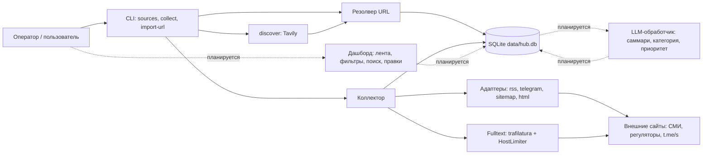
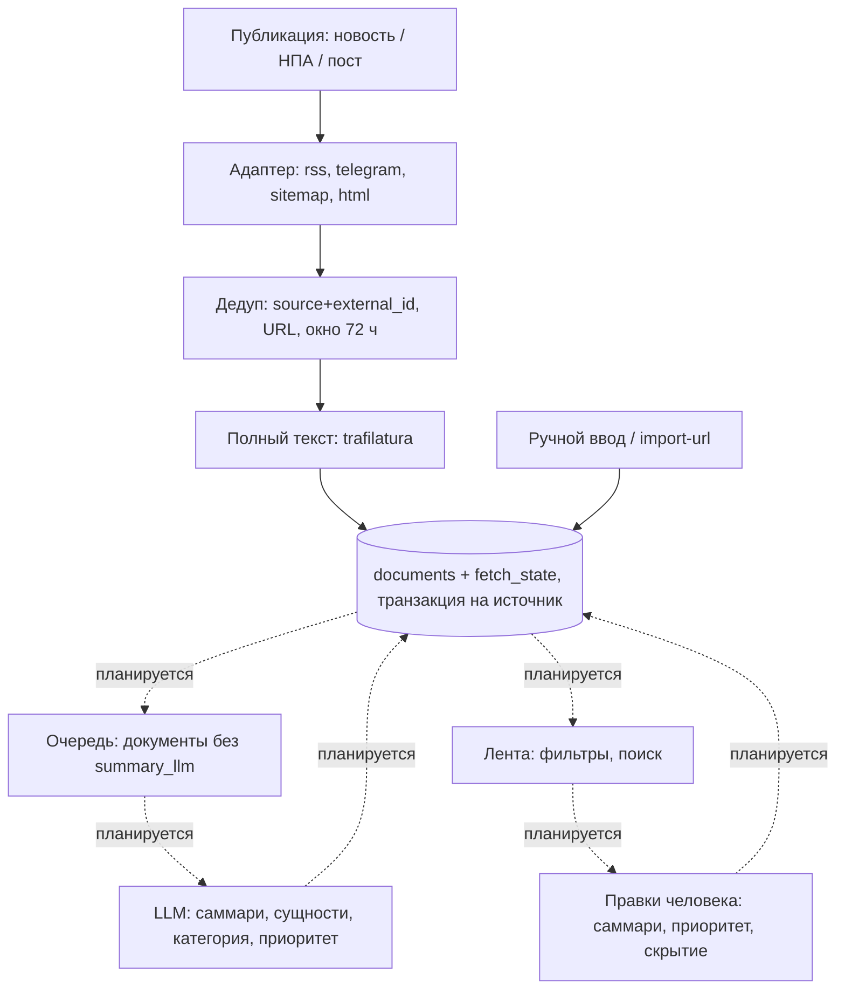

# Целевая архитектура

## Что должно быть:

- Основные компоненты; 
- Поток данных от входящего тикета до ответа/маршрутизации; 
- Синхронные и асинхронные части; 
- Хранилища; 
- Места вызова сервисов и интеграций; 
- Участие человека и запасные пути. 
- Использовать Mermaid для вспомогательных диаграмм.

*Статус на 02.09.2026: реализован и проверен вживую этап 1.1 «Сбор данных» (`src/sources`, `src/storage`, `src/cli.py`). Всё, что ниже помечено «планируется», — целевой дизайн этапов 1.2–1.4; кода под него в репозитории пока нет.*

## Основные компоненты

- **Резолвер источника + адаптеры** (`src/sources/resolver.py`, `scraper_*.py`). Пользователь вводит один URL, резолвер сам выбирает способ опроса: `t.me/…` → telegram; URL, похожий на ленту и разбирающийся feedparser'ом → rss; `<link rel="alternate">` или типовые пути (`/rss`, `/feed`, …) → rss; `robots.txt` / `sitemap.xml` с `lastmod` → sitemap; иначе → html (diff ссылок). Четыре адаптера за одним интерфейсом `Adapter.fetch(source, state, client, *, now, since, backfill) -> FetchResult` возвращают единый `RawDocument`; это и есть механика «добавления источника по ссылке» из требования 1.4.
- **Коллектор и извлечение полного текста** (`collector.py`, `fulltext.py`). Опрашивает включённые источники, отсекает дубли, дотягивает текст анонсов через trafilatura (заголовок / автор / дата / текст) и пишет в SQLite; `HostLimiter` держит не больше 2 одновременных запросов к одному хосту (`per_host_concurrency`, gov.ru банит бурсты).
- **Хранилище и CLI** (`src/storage/db.py`, `src/cli.py`). SQLite `data/hub.db` — единственное место состояния (источники, документы, курсоры, история прогонов). CLI сегодня и интерфейс оператора, и «планировщик»: `collect [--watch --interval]`, `sources add|list|enable|disable|remove|resolve|seed`, `resolve`, `discover`, `import-url`, `docs`.
- **Планируется (1.2–1.4):** LLM-обработчик — саммари в 3–5 предложений с сущностями «кто / что / когда / последствия», категория (регуляторика / репутация / конкуренты / тренды), приоритет (высокий / средний / низкий), теги; веб-дашборд с лентой, фильтрами, поиском, правками и управлением источниками; карточка НПА с историей статусов (анонс → на рассмотрении → подписан/действует).

## Поток данных: от входящей публикации до ленты

*В шаблоне это «поток от входящего тикета до ответа/маршрутизации». Тикетов в продукте нет: единица потока — публикация (новость / НПА / пост Telegram-канала), а «ответ и маршрутизация» — карточка в ленте с категорией и приоритетом.*

- **Сбор (реализовано).** Каждый тик (`collect --watch --interval 900`, то есть 15 минут — ориентир task.md «материал в ленте за 15 минут, сайты регуляторов — до часа») коллектор опрашивает каждый включённый источник его адаптером: RSS — условный GET по ETag / Last-Modified (на втором smoke-прогоне все RSS-ленты с ETag ответили 304), Telegram — только посты после курсора `last_post_id` (до 5 страниц `?after=` за тик), sitemap — записи новее курсора `lastmod` (до 5 дочерних sitemap, 200 URL), HTML — ссылки, которых ещё нет в `seen_urls`.
- **Дедуп, полный текст, сохранение (реализовано).** Отбрасывается всё, что уже есть по `(source_id, external_id)` или по URL; на первом запуске берутся материалы не старше 72 ч (`date_window_hours`), недатированные остаются (страницы НПА часто без даты), не больше 50 новых на источник за проход (`max_new_per_source`). Для анонсов полный текст дотягивается trafilatura (до 20 000 символов). Запись — одна транзакция на источник: документы + ETag/курсор + `fetch_state` вместе, чтобы курсор не ушёл вперёд без документов. Smoke-прогон 02.09.2026: 17/17 источников, 268 документов за первый проход, все три категории источников (СМИ, регуляторы, Telegram); второй проход — 0 новых.
- **Обработка (планируется, 1.2).** Новый документ → LLM → `summary_llm`, сущности, `category`, `priority`, `tags` в той же строке `documents`. Ориентир task.md: 10–15 с на публикацию. Для НПА карточка долгоживущая: статус обновляется (анонс → на рассмотрении → подписан/действует), версии, отзывы и слушания копятся в истории, архив — после «принято, действует с <дата>»; новости — «прочитал и забыл».
- **Лента и правки (планируется, 1.3–1.4).** Дашборд читает `documents` с фильтрами по источнику, дате, категории и приоритету и поиском по тексту / тегам / сущностям (ориентир < 1 с). Пользователь правит заголовок, саммари, категорию, приоритет, теги; скрывает публикацию (`documents.hidden` уже зарезервировано) или источник; добавляет материал вручную — всё это записи в ту же таблицу, лента показывает результат.

## Синхронные и асинхронные части

- **Сейчас: пул потоков + запись в главном потоке.** Опрос источников идёт в `ThreadPoolExecutor` (`concurrency: 8`), рабочие делают только HTTP и разбор; вся запись в SQLite — в главном потоке по мере готовности результатов (`as_completed`). Полный текст дотягивается на этапе сохранения отдельным пулом (до 8 потоков на источник) под лимитом 2 запроса на хост. Расписание — цикл `collect --watch` с паузой `--interval` (900 с по умолчанию); настоящего планировщика нет.
- **Синхронно для пользователя:** `sources add` (резолвер: основной запрос с таймаутом 20 с, пробы типовых путей — 8 с, чтобы медленный сайт не подвешивал команду), `import-url` (страница → trafilatura → БД), просмотр ленты и поиск (планируется, ориентир < 1 с).
- **Планируется: быстрый и медленный путь.** Быстрый — сбор → сохранение → карточка в ленте без саммари через секунды после тика, чтобы уложиться в «15 минут до ленты». Медленный — асинхронный воркер, который берёт документы без `summary_llm`, зовёт LLM (10–15 с на публикацию) и дописывает результат. При недоступности LLM карточки остаются в ленте «сырыми», очередь копится в БД и разбирается позже; сбор от LLM не зависит.
- **Планируется: планировщик** вместо `--watch`: раздельные интервалы по типу источника (Telegram и RSS чаще, sitemap/HTML реже — допущение, сегодня один интервал на всех) и запуск LLM-воркера по факту появления новых документов.

## Хранилища

- **SQLite `data/hub.db`** — WAL, `foreign_keys`, `busy_timeout` 5 с, миграции по `PRAGMA user_version` (сейчас v1). WAL выбран, чтобы дашборд мог читать, пока `collect --watch` пишет. Одно соединение на процесс, только из главного потока.
- **Таблицы:** `sources` (что ввёл пользователь + `kind` / `fetch_url`, выбранные резолвером, `enabled`); `documents` (нормализованный `RawDocument`: заголовок, анонс, текст, автор, вложения, `published_at`, `content_hash`; `UNIQUE(source_id, external_id)`, индекс по URL; `hidden` зарезервировано под 1.4); `fetch_state` (ETag, Last-Modified, JSON-курсор адаптера, `last_error`, `consecutive_failures`); `seen_urls` (что html-адаптер уже видел); `collect_runs` (история прогонов). `raw_html` по умолчанию не хранится (`store_raw_html: false`).
- **Планируется (1.2–1.4):** колонки `summary_llm`, `category`, `priority`, `tags`; правки пользователя отдельно от LLM-версии, чтобы пересчёт их не затирал; FTS5 по тексту, тегам и сущностям; схлопывание дублей в одну карточку по `content_hash`; история статусов НПА.
- **Внешние хранилища не нужны:** вложения хранятся ссылками (`attachments`), кэш страниц — сама таблица `documents`. PostgreSQL (стек заказчика GS Labs) — на выбор при выходе за прототип, критерий — несколько писателей/сервисов; для одного процесса SQLite достаточно (промышленная нагрузка вне скоупа хакатона).

## Места вызова сервисов и интеграций

- **Внешние сайты (реализовано):** RSS/Atom-ленты СМИ и регуляторов (Ведомости, Коммерсантъ, Телеспутник, ЦБ РФ, government.ru), sitemap (Кабельщик), HTML-diff (duma.gov.ru), публичное превью `t.me/s/<канал>` для 9 каналов из task.md — без ключей и учёток. Один общий `httpx.Client` на прогон, браузерный User-Agent, `Accept-Language: ru`, таймаут 20 с, до 5 редиректов; ошибки не выбрасываются, а возвращаются в `FetchResult.error`.
- **Tavily (`discover`, реализовано)** — поиск кандидатов в источники по запросу, ключ `TAVILY_API` из `.env`, найденные сайты прогоняются через резолвер (`--add`). Явно не коллектор: западные поисковые API плохо индексируют gov.ru, поэтому это дополнение к RSS/Telegram. Планируется: Yandex Search API для доменов регуляторов и обогащение карточки («кто ещё писал о законопроекте»).
- **LLM (планируется)** — вызывается только из асинхронного воркера медленного пути, никогда из запроса пользователя; вход — заголовок + текст (обрезан до 20 000 символов) или пояснительная записка НПА (по Q&A её достаточно вместо тела закона); выход — структурированный ответ с саммари, сущностями, категорией и приоритетом. Выбор модели и провайдера — в `ml.md`.
- **Отдельные адаптеры (планируется):** regulation.gov.ru (JS-приложение без RSS и sitemap — нужен API портала), publication.pravo.gov.ru (sitemap без `lastmod`), СОЗД Госдумы (карточка законопроекта со стадиями и версиями), digital.gov.ru / rkn.gov.ru (таймаут из dev-сети — перепроверить из российской). Сегодня все они в списке `excluded` в `sources.json` с причиной. Опционально MTProto (Telethon) вместо превью — для каналов без веб-превью и реального push.

## Участие человека и запасные пути

- **Резолвер деградирует ступенями:** ленты нет → sitemap с `lastmod` → diff ссылок HTML; недоступный сейчас сайт всё равно добавляется как html с пометкой «unreachable now»; приватная Telegram-ссылка — как `manual`. `sources add --kind --fetch-url` закрепляет адрес руками (так закреплены ленты Коммерсанта и ЦБ, которые резолвер сам не находит), `sources resolve` перепроверяет и сбрасывает курсор.
- **Сбой одного источника не останавливает прогон:** ошибка пишется в `fetch_state.last_error` / `consecutive_failures` и видна в `sources list`; `sources disable` выключает шумный или упавший источник, `sources remove` удаляет вместе с документами, `collect --force` / `--backfill` перечитывают. Сайты, которые резолверу не по зубам, живут в `excluded` с причиной, а не молча.
- **Ручной ввод — полноправный источник:** встроенный источник «Ручной импорт» и `import-url` для «прочитай вот это»; дайджесты правового комитета АРПП приходят файлами по понедельникам и вносятся руками. Планируется: форма ручного добавления новости / документа в дашборде.
- **Человек ранжирует, система подсказывает (планируется).** LLM даёт грубый уровень «релевантно / нерелевантно, молния / не молния»; ошибки асимметричны — критичное не должно проваливаться в «низкий», поэтому при низкой уверенности карточка идёт вверх, а не вниз (полнота важнее чистоты). Редактирование саммари (заметки, правка галлюцинаций, смена акцента), смена категории и приоритета, скрытие из ленты — руками, и правка человека имеет приоритет над пересчётом. При недоступной LLM лента показывает сырую карточку с анонсом источника.
